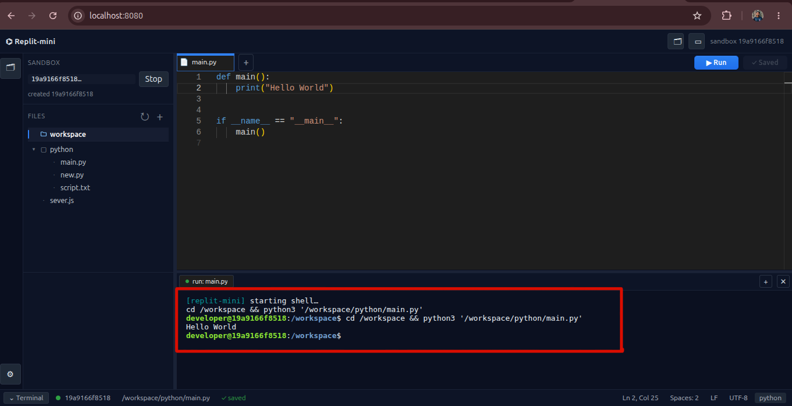
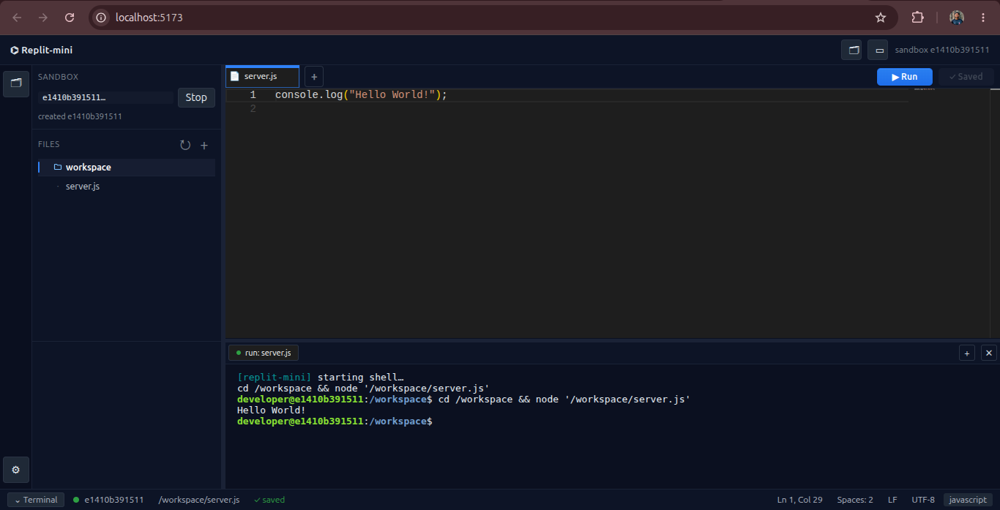

### Replit-Mini

This repository contains a browser-based coding environment inspired by Replit. It gives users a web editor, terminal access, and a sandboxed execution environment so they can create files, run code, and interact with a live container from the browser.

Objectives:
- full-stack web development with React and Node.js
- real-time communication with Socket.IO
- container orchestration with Docker
- isolated code execution in sandbox containers
- how a browser-based IDE can be built from scratch


---

## 1. Project Overview

The application has three main parts:

1. Frontend
   - Built with React and Vite
   - Provides the editor, sidebar, terminal panel, and UI chrome
   - Uses Monaco Editor for code editing and xterm.js for terminal display

2. Backend
   - Built with Node.js and Express
   - Handles API requests and WebSocket communication
   - Connects the browser to sandbox containers

3. Sandbox Environment
   - Uses Docker containers to run user code safely
   - Gives each session an isolated workspace
   - Allows the user to execute files and interact with a terminal

In short, the project is a mini online IDE where the browser acts as the client, the backend manages containers, and Docker provides the execution environment.

> Important note: This Replit-mini app is mainly intended for editing and running JavaScript and Python files. The built-in Run action currently supports JavaScript and Python execution through Node.js and Python inside the sandbox. Other languages can be created and edited, but they are not the main supported workflow for this lab.

---

## 2. Learning Objectives

By completing this lab, you will learn how to:
- install and run a full-stack project locally
- understand the frontend and backend architecture
- run the app with Docker
- install dependencies for both the client and server
- explore how file editing and terminal execution work
- troubleshoot common setup issues

---

## 3. Required Environment

Before starting, make sure the following software is installed on your computer.

### Required software
- Git
- Node.js 20+ and npm
- Docker Engine 24+ with Docker Compose plugin
- A terminal (bash, zsh, or PowerShell)
- VS Code is recommended

### Verify the installation

Run the following commands:

```bash
docker --version
docker compose version
node --version
npm --version
git --version
```

If you see version numbers, your environment is ready.


### Linux-specific Docker setup
If Docker requires sudo on your machine, add your user to the Docker group:

```bash
sudo usermod -aG docker $USER
newgrp docker
```

Then verify again:

```bash
docker ps
```
---

## 4. Step-by-Step Lab Instructions

### Step 1: Clone the project

```bash
# 1. Clone the repository skeleton (no files downloaded yet)
git clone --no-checkout --sparse --filter=blob:none https://github.com/poridhioss/minions-26

# 2. Enter the repository directory
cd minions-26

# 3. Set the sparse-checkout path to specific project
git sparse-checkout set Fawaj_Suraim/puku-editor-interns-Fawaj_Suraim-6

# 4. Checkout the files into your local system
git checkout

# 5. Nevigate to the project directory
cd Fawaj_Suraim/puku-editor-interns-Fawaj_Suraim-6/
```


---

### Step 2: Environment Setup

### Required Backend dependencies
The backend uses the following packages:
- express
- cors
- socket.io
- dockerode
- nodemon (development)

Navigate to the project directory `Fawaj_Suraim/puku-editor-interns-Fawaj_Suraim-6/` and install the dependencies with:

```bash
cd backend
npm install
```


### Required Frontend dependencies
The frontend uses the following packages:
- react
- react-dom
- vite
- @monaco-editor/react
- socket.io-client
- @xterm/xterm
- @xterm/addon-fit
- eslint and related development tools

Install them with:

```bash

cd frontend
npm install
```


---

### Step 3: Build and run the project with Docker (recommended)

This is the easiest way to run the full application locally.

Navigate to the project directory `Fawaj_Suraim/puku-editor-interns-Fawaj_Suraim-6/` and execute the following command:
```bash
make up
```


Then open the application in your browser:

- http://localhost:8080



To stop the stack later:

```bash
make down
```


### Step 4: Understand the project structure

The important folders are:
- backend/ — Node.js server and Docker orchestration logic
- frontend/ — React UI and editor experience
- docker-compose.yml — Docker service configuration
- Makefile — helper commands for starting and stopping the stack


### Step 5: Run the project in native mode (optional)

This method runs the backend and frontend directly on your machine.

Open two terminals.

Terminal 1 — backend:

```bash
cd backend
npm install
npm run dev
```


Terminal 2 — frontend:

```bash
cd frontend
npm install
npm run dev
```


Then open:

- http://localhost:5173

The frontend will connect to the backend on port 3001.




---

## 5. How to Use the Application

Once the app is running, follow these steps:

1. Open the browser-based IDE.
2. Create or open a file from the sidebar.
3. Write code in the Monaco editor.
4. Save your file.
5. Run the file using the built-in run action.
6. Observe the terminal output in the sandbox container.

This demonstrates the main workflow of the project: edit → save → execute.

---

## 6. Features and Limitations

### Features
- Browser-based code editor with Monaco Editor
- Sidebar-based file explorer and tabbed editing
- Terminal access inside a Docker sandbox
- Support for saving and running files from the browser
- Isolated execution environment for each session
- Real-time communication between frontend and backend using Socket.IO

### Limitations
- The main supported runtime workflow in this lab is JavaScript and Python.
- The built-in Run action is designed for JavaScript and Python files through Node.js and Python in the sandbox.
- This project is a mini IDE and does not provide the full feature set of professional tools like VS Code or Replit.
- Advanced features such as multi-language support, package management for all languages, and full debugging tools are not the focus of this lab.
- Docker must be available on the machine for the sandboxed execution workflow.

---

## 7. Project Components to Explore

### Backend
Key files include:
- backend/src/server.js — main server entry point
- backend/src/routes/containers.js — container-related routes
- backend/src/routes/files.js — file read/write routes
- backend/src/services/docker.js — Docker sandbox management
- backend/src/services/terminal.js — terminal execution bridge

### Frontend
Key files include:
- frontend/src/App.jsx — main UI application shell
- frontend/src/components/EditorPane.jsx — editor component
- frontend/src/components/TerminalPane.jsx — terminal UI
- frontend/src/api.js — API calls to the backend

### Infrastructure
- docker-compose.yml — defines the frontend and backend containers
- backend/Dockerfile.sandbox — creates the sandbox image used for code execution
- Makefile — shortcuts for building and running the app

---

## 7. Common Troubleshooting

### Docker permission issue
If Docker commands fail with permission errors:

```bash
sudo usermod -aG docker $USER
newgrp docker
```

### Sandbox image missing
If the sandbox image is not found:

```bash
make sandbox
```
### Frontend does not connect to backend
Check that the backend is running and that the app is opened on the correct port.

### Port already in use
If port 8080 or 5173 is occupied, stop the other process or change the port.

---

## 8. Summary

This project is a practical example of how a browser-based IDE can be built using:
- React for the interface
- Node.js for the server
- Socket.IO for real-time communication
- Docker for secure code execution

It is an excellent lab project because it combines frontend development, backend development, networking, and containerization in one complete system.
