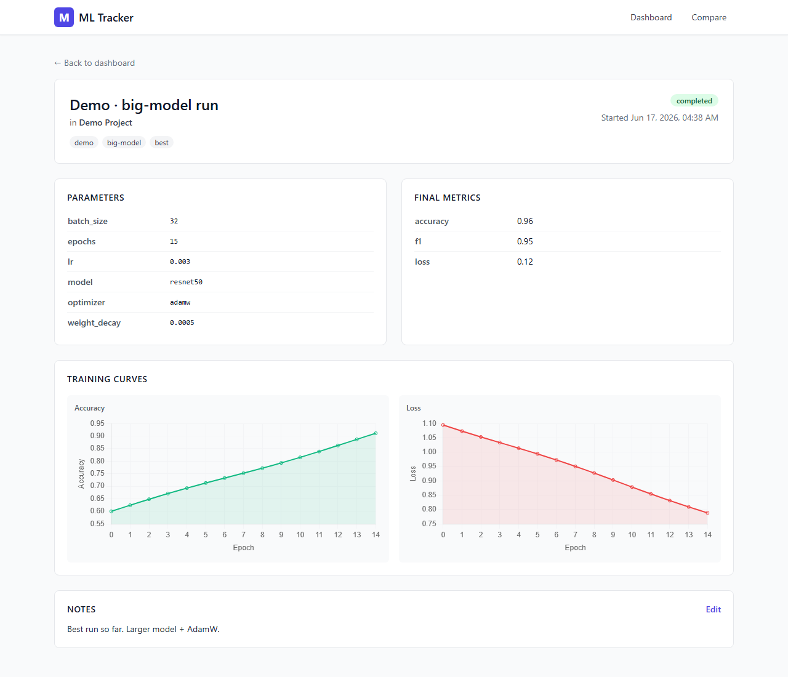
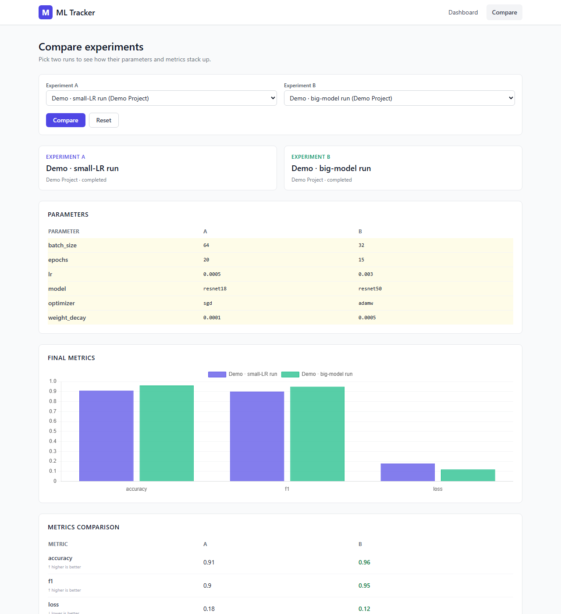

<!-- markdownlint-disable -->
<!-- The empty <base> tag fixes "Unable to get absolute uri between \README.md and ; Base path '' must be an absolute path"
     errors in some Markdown renderers (e.g. GitLab Duo Agent Platform's preview)
     that pass the file's absolute path through urljoin('', path) and expect a real URL base. -->
<base href=".">

# ML Experiment Tracking Platform

> **Author:** Mahi Abdullah
> **Project-12** — ML Experiment Tracking Platform: A local ML experimentation system.
> A simple, local-first way to log your ML training runs and see them in a clean dashboard. No cloud accounts, no Docker, no setup headaches — just Python, Flask, and a single SQLite file.


## Screenshots

| Dashboard | Detail | Compare |
| :-------: | :----: | :-----: |
|  |  |  |

---

## Table of Contents

1. [What is this?](#what-is-this)
2. [Architecture (at a glance)](#architecture-at-a-glance)
3. [Features](#features)
4. [Tech stack](#tech-stack)
5. [Project layout](#project-layout)
6. [Setup](#setup)
7. [SDK usage](#sdk-usage)
8. [HTTP API](#http-api)
9. [How it works (the short version)](#how-it-works-the-short-version)
10. [Troubleshooting](#troubleshooting)
11. [Roadmap](#roadmap)
12. [License](#license)

---

## What is this?

If you train machine-learning models on your own computer, you probably want to:

- See all of your past runs in one place
- Remember which hyperparameters you used
- Plot per-epoch metrics
- Compare two runs side by side

Tools like MLflow or Weights & Biases do this, but they need an account, a server, or both. **ML Experiment Tracking Platform** does the same job for your laptop, with no extra services to run. You write a few lines of Python in your training script, and a local web page shows your results.

---

## Architecture (at a glance)

```text
   Your training script
         │
         │  from tracker import start_run
         │  run = start_run("resnet50-v3", project="vision")
         │  run.log_params({...})
         │  run.log_metric("loss", 0.42, step=1)
         ▼
   ┌──────────────────────────┐         ┌──────────────────────────┐
   │  tracker.py  (the SDK)   │  ─────▶ │  experiments.db (SQLite) │
   └──────────────────────────┘         └──────────────────────────┘
                                                   │
                                                   │  read
                                                   ▼
                                         ┌──────────────────────────┐
                                         │   app.py  (Flask)        │
                                         │   pages + JSON API       │
                                         └──────────────────────────┘
                                                   │
                                                   │  HTML + Chart.js
                                                   ▼
                                            Your browser at
                                           http://127.0.0.1:5000
```

**Three moving parts:**

| Part                | File          | What it does                                                                 |
| ------------------- | ------------- | ---------------------------------------------------------------------------- |
| **SDK**             | `tracker.py`  | Tiny Python helper you `import` in your training code. Writes to SQLite.     |
| **Database**        | `experiments.db` | A single SQLite file. Created on first run, lives next to your code.      |
| **Web app**         | `app.py`      | Flask server. Renders the dashboard, detail, and compare pages, plus a JSON API. |
| **Templates**       | `templates/`  | HTML files styled with Tailwind. Charts drawn by Chart.js from a CDN.        |

Nothing else. No Redis, no message queue, no auth, no build step.

---

## Features

- **One-line SDK** — wrap your training loop in `with start_run(...) as run:`
- **Per-epoch metrics** — `run.log_metric("loss", value, step=epoch)` is all you need
- **Hyperparameter logging** — `run.log_params({...})` stores a JSON blob per run
- **Final metrics + notes** — call `run.finish(metrics=..., status=...)` at the end
- **Auto status** — runs are `running`, then `completed` on success or `failed` on exception
- **Dashboard** — sortable columns, project filter, search box, status badges
- **Detail page** — Chart.js line chart for every logged metric
- **Compare page** — pick two runs and see them side by side with a grouped bar chart
- **JSON API** — every page is also available as JSON
- **Notes PATCH** — edit a run's notes from the browser, no Python needed
- **Single file portability** — back up or share your work by copying `experiments.db`

---

## Tech stack

| Layer    | Tech                          | Role                                                       |
| -------- | ----------------------------- | ---------------------------------------------------------- |
| SDK      | Python stdlib + `sqlite3`     | `start_run()` and the `Run` class                          |
| Server   | Flask 3.x                     | HTML pages and JSON API on `127.0.0.1:5000`                |
| Storage  | SQLite (stdlib)               | One file; schema created on boot                          |
| UI       | Jinja2 + Tailwind via CDN     | `base.html`, `dashboard.html`, `detail.html`, `compare.html` |
| Charts   | Chart.js 4.4.1 via jsdelivr   | Line chart on detail; grouped bar on compare               |

---

## Project layout

```text
.
├── app.py                 # Flask app: routes, error handlers, JSON API
├── database.py            # SQLite connection, schema, migrations
├── tracker.py             # SDK: start_run() / Run class
├── sample_run.py          # Seeds 3 demo runs into "Demo Project"
├── requirements.txt       # flask>=3.0,<4.0
├── templates/             # base, dashboard, detail, compare, 404
├── static/main.js         # Reserved for shared client helpers
└── docs/                  # screenshot-dashboard/detail/compare.png
```

---

## Setup

**You need:** Python 3.9 or newer, `pip`, and a modern browser. That's it.

### Step 1 — Get the code

```powershell
git clone https://github.com/mahiiabdullah/ML-Experiment-Tracking.git
cd "ML Experiment Tracking Platform - A local ML experimentation system"
```

If you downloaded the folder directly, just `cd` into it.

### Step 2 — Create a virtual environment (recommended)

A virtual environment keeps this project's packages separate from your system Python.

```powershell
python -m venv .venv
.\.venv\Scripts\Activate.ps1
```

You'll know it worked if your prompt now starts with `(.venv)`.

### Step 3 — Install dependencies

```powershell
pip install -r requirements.txt
```

This installs Flask. Everything else is in the Python standard library.

### Step 4 — (Optional) seed demo data

```powershell
python sample_run.py
```

This creates three fake runs in a project called "Demo Project" so the dashboard isn't empty. Safe to run multiple times.

### Step 5 — Start the server

```powershell
python app.py
```

Open <http://127.0.0.1:5000/> in your browser. You should see the dashboard. Edit any file under `templates/` and the page will reload automatically.

### Optional environment variables

| Var                | Default     | Purpose                                |
| ------------------ | ----------- | -------------------------------------- |
| `FLASK_RUN_HOST`   | `127.0.0.1` | Bind address (set to `0.0.0.0` to expose on your LAN) |
| `FLASK_RUN_PORT`   | `5000`      | TCP port                               |

Pass them like `FLASK_RUN_PORT=5001 python app.py` (PowerShell: `$env:FLASK_RUN_PORT=5001; python app.py`).

---

## SDK usage

Add these lines to your training script:

```python
from tracker import start_run

# 1) Open a run. `name` is required; `project` and `tags` are optional.
with start_run("resnet50-v3", project="cv", tags="imagenet,baseline") as run:

    # 2) Save your hyperparameters once.
    run.log_params({"lr": 1e-3, "batch_size": 64, "optimizer": "adamw"})

    # 3) Inside your training loop, log a metric per epoch.
    for epoch in range(10):
        train_loss = train_one_epoch(...)     # your code
        val_acc    = evaluate(...)            # your code
        run.log_metric("train_loss", train_loss, step=epoch)
        run.log_metric("val_acc",    val_acc,    step=epoch)

    # 4) Save final numbers and optional notes.
    run.finish(metrics={"final_acc": val_acc, "final_loss": train_loss},
               status="completed")
```

**What happens automatically:**

- If the `with` block exits normally, the run is marked `completed`.
- If it raises an exception, the run is marked `failed` and the original error still propagates.
- `finish()` is idempotent — calling it twice is safe.

**Available methods on the `Run` object:**

| Method                                | Purpose                                              |
| ------------------------------------- | ---------------------------------------------------- |
| `log_params(dict)`                    | Save hyperparameters as a JSON blob                  |
| `log_metric(name, value, step)`       | Log one metric reading at a given step               |
| `log_epoch(name, value, step)`        | Alias for `log_metric` (kept for older scripts)      |
| `finish(metrics=None, status="completed")` | Mark the run as done; save final metrics        |

---

## HTTP API

Base URL: `http://127.0.0.1:5000`. Every error response has the shape `{"error": str, "detail": str|null}`.

### `GET /api/experiments`

List all runs, newest first. Optional filters:

- `project=<exact>` — show only runs in this project
- `search=<substring>` — case-insensitive match across name, project, and tags

```http
GET /api/experiments?project=Demo%20Project
```

```json
[
  {
    "id": 2,
    "name": "Demo · big-model run",
    "project": "Demo Project",
    "tags": "demo,transformer",
    "params": {"lr": 0.001, "epochs": 10, "batch_size": 64, "model": "transformer-xl"},
    "metrics": {"final_loss": 0.182, "final_acc": 0.94},
    "notes": "Best run so far.",
    "status": "completed",
    "created_at": "2026-06-17T10:21:02",
    "end_time": "2026-06-17T10:21:03",
    "epoch_metrics": []
  }
]
```

### `GET /api/experiment/<id>`

One run plus its `epoch_metrics` array. Returns `404` if the id is unknown.

### `GET /api/compare?ids=<id1>,<id2>`

Two or more runs, in the order you list them. Returns `400` if you give fewer than two.

### `PATCH /api/experiment/<id>/notes`

Update a run's notes. Body must be JSON with a `notes` field.

```http
PATCH /api/experiment/2/notes
Content-Type: application/json

{"notes": "Switched to cosine LR schedule."}
```

```json
{"id": 2, "notes": "Switched to cosine LR schedule.", "...": "..."}
```

---

## How it works (the short version)

1. **`init_db()` runs on import** — it creates the `experiments` and `epoch_metrics` tables in `experiments.db` if they don't exist, and adds an `end_time` column on older databases.
2. **`start_run(name, project, tags)`** — inserts a new row in `experiments` with `status="running"` and returns a `Run` bound to that row's id.
3. **`log_params(dict)`** — stores the dict as JSON in the `params` column. Each call merges into the previous value.
4. **`log_metric(name, value, step)`** — appends one row to `epoch_metrics`. The detail page groups by `metric_name` and plots every step.
5. **`finish(metrics, status)`** — stores the final `metrics` JSON, sets `status` (`completed` / `failed` / `crashed` / `killed`), and stamps `end_time`.
6. **Flask routes** serve three HTML pages and four JSON endpoints. Every API route is wrapped in a small helper that converts `sqlite3` errors into clean JSON `500`s.
7. **The compare page** fetches all runs into two dropdowns; the chart updates client-side.

---

## Troubleshooting

| Problem                                              | Cause                                              | Fix                                                       |
| ---------------------------------------------------- | -------------------------------------------------- | --------------------------------------------------------- |
| `ModuleNotFoundError: No module named 'flask'`       | Dependencies not installed                         | `pip install -r requirements.txt`                         |
| `sqlite3.OperationalError: no such table: experiments` | `experiments.db` was deleted without re-init      | `python -c "from database import init_db; init_db()"`     |
| Dashboard shows zero rows after `sample_run.py`      | An old `python app.py` process is holding the DB   | Stop the old server, then re-run `sample_run.py`          |
| Port 5000 already in use                             | Another process is on 5000                         | `FLASK_RUN_PORT=5001 python app.py`                       |
| Tailwind / Chart.js look unstyled on first load      | No internet on the first request                   | Refresh once you're online, or vendor the CDN files       |
| `PATCH /notes` returns 400                           | Body isn't JSON, or `notes` field is missing       | Send `Content-Type: application/json` with `{"notes": ""}` |
| Compare page says "Nothing to compare yet"           | One dropdown is empty, or there's only one run     | Pick two distinct runs, or run `sample_run.py`            |
| `werkzeug` reloader complains                        | Non-ASCII path or symlink loop on Windows          | Move the project to an ASCII path with no spaces          |

---

## Roadmap

- [ ] Async-friendly `start_run` for `asyncio` training loops
- [ ] `run.log_artifact(path)` for checkpoints and config files
- [ ] Nested runs for hyperparameter sweeps
- [ ] CSV / JSON export of `/api/experiments`
- [ ] WebSocket push so the dashboard updates without refresh
- [ ] `ML_TRACKER_DB` env var to support multiple projects
- [ ] Pagination on `/api/experiments`
- [ ] Sparkline previews on dashboard cards
- [ ] Dark mode toggle persisted to `localStorage`
- [ ] `pytest` suite + GitHub Actions CI

---

## License

Do whatever you want with this code.
