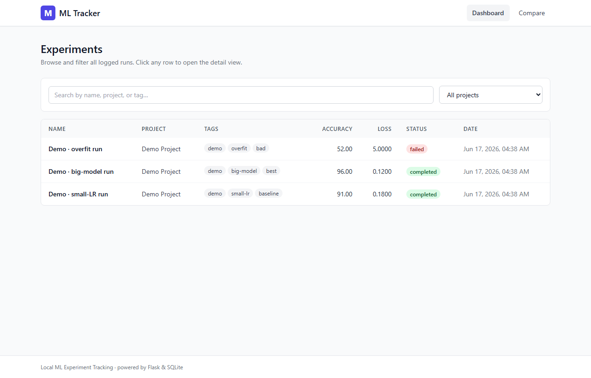

# ML Experiment Tracking Platform

> **Author:** Poridhi Labs
> **Project ML Experiment Tracking Platform:** A local-first Flask + SQLite experiment tracker that captures hyperparameters, per-epoch metrics, and final results from your training scripts and surfaces them in a Tailwind dashboard — no cloud, no accounts, no Docker.



---

## Table of Contents

1. [What is this?](#what-is-this)
2. [Features](#features)
3. [Architecture](#architecture)
4. [Data Flow](#data-flow)
5. [Project Structure](#project-structure)
6. [Prerequisites](#prerequisites)
7. [Quick Start](#quick-start)
8. [Environment Variables](#environment-variables)
9. [API Reference](#api-reference)
10. [Frontend](#frontend)
11. [How it Works (Internals)](#how-it-works-internals)
12. [Requirements](#requirements)
13. [Troubleshooting](#troubleshooting)
14. [Roadmap](#roadmap)
15. [License](#license)

---

## What is this?

**ML Experiment Tracking Platform** is a self-contained Python web app for ML practitioners who run training scripts on their own machine and want clean visualization of the results without spinning up a cloud service like Weights & Biases, MLflow, or Neptune. The whole thing fits in a single project folder: a small Python SDK you `import` from your training script, a Flask HTTP server that serves both an HTML dashboard and a JSON API, and one SQLite file that holds everything.

The core loop is simple. You wrap a section of your training code in a `with start_run(...) as run:` block, log hyperparameters with `run.log_params(...)`, push per-epoch metrics with `run.log_metric(...)`, and call `run.log_metrics(...)` for final numbers. When the block exits, the run is marked `completed` and immediately appears on the dashboard with sortable columns, a tags filter, and a detail page that renders per-epoch line charts. A second view lets you pick any two runs and see their parameters and final metrics side by side, with a grouped bar chart for the comparison.

The entire stack is intentionally tiny: under 1,000 lines of Python, no build step, no JavaScript framework, no external services, no auth. It's the kind of tool you keep in a `tools/` folder and reach for when you want to compare "ResNet vs. EfficientNet" runs without leaving your laptop. Because it's all local SQLite, you can back up, fork, or share experiments by copying one file.

---

## Features

- ✅ **One-line SDK** — wrap any training loop in `with start_run(...) as run:` and everything auto-persists on context exit.
- ✅ **Per-epoch metrics** — `run.log_metric(name, value, step)` writes a row to `epoch_metrics`; the detail page renders them as a Chart.js line chart.
- ✅ **Hyperparameter capture** — `run.log_params({...})` stores a JSON dict that round-trips intact and shows up in the compare view.
- ✅ **Final metrics** — `run.log_metrics({...})` plus an optional `notes` string round out each run.
- ✅ **Searchable dashboard** — filter by project name, free-text search across run name + tags, and sort by any column.
- ✅ **Status tracking** — `running` / `completed` / `failed` are first-class, set automatically by the context manager or via `run.finish(status="failed")`.
- ✅ **Side-by-side compare** — pick any two runs and see parameters (with diffs highlighted) plus a grouped bar chart of final metrics.
- ✅ **Inline notes editor** — PATCH `notes` straight from the detail page; no form page, no reload.
- ✅ **JSON API** — every page is also an endpoint, so a colleague's script can hit `/api/experiments` instead of scraping HTML.
- ✅ **Single-file portability** — the entire database is one `experiments.db` SQLite file you can `cp`, `scp`, or check into a results repo.
- ✅ **Zero-config defaults** — works out of the box on a clean `python -m venv .venv && pip install -r requirements.txt && python app.py`.

---

## Architecture

The system is a single Flask process serving Jinja-templated HTML, Tailwind via CDN, and a small JSON API. The SDK is a separate module that the user's training script imports; it opens its own short-lived SQLite connection and writes rows directly. There is no message queue, no worker process, and no separate database server.

```text
                        ┌──────────────────────────────────────────────┐
                        │         Training script (your code)          │
                        │   from tracker import start_run               │
                        │   with start_run("resnet50", project="cv")   │
                        │        as run:                               │
                        │           run.log_params({...})              │
                        │           run.log_metric("loss", v, step)    │
                        └──────────────────────┬───────────────────────┘
                                               │ import + function calls
                                               ▼
                        ┌──────────────────────────────────────────────┐
                        │              tracker.py (SDK)                │
                        │   start_run() factory, Run class, ctx mgr    │
                        │   writes params/metrics/notes/status         │
                        └──────────────────────┬───────────────────────┘
                                               │ direct SQLite writes
                                               ▼
                        ┌──────────────────────────────────────────────┐
                        │              experiments.db (SQLite)          │
                        │   tables: experiments, epoch_metrics         │
                        │   schema + end_time migration in database.py │
                        └──────────────────────┬───────────────────────┘
                                               │ same DB file, opened read-only
                                               ▼
                        ┌──────────────────────────────────────────────┐
                        │        Flask app on 127.0.0.1:5000           │
                        │   app.py: routes + error handlers + logging  │
                        │   /             -> dashboard.html            │
                        │   /experiment/n -> detail.html               │
                        │   /compare      -> compare.html              │
                        │   /api/...      -> JSON                      │
                        └──────────────────────┬───────────────────────┘
                                               │ HTTP (HTML or JSON)
                                               ▼
                        ┌──────────────────────────────────────────────┐
                        │         Tailwind CDN + Chart.js 4.4.1         │
                        │   served as static <script>/<link> tags      │
                        │   in base.html, no local build step          │
                        └──────────────────────────────────────────────┘
```

**Components at a glance**

| Component   | Tech                       | Role                                                                          |
| ----------- | -------------------------- | ----------------------------------------------------------------------------- |
| SDK         | Python stdlib + `sqlite3`  | `start_run()` factory and `Run` class; context manager writes to DB on exit   |
| App server  | Flask 3.x (single process) | Serves HTML pages and JSON API on `127.0.0.1:5000`                            |
| Database    | SQLite (stdlib)            | One file (`experiments.db`); schema + `end_time` migration on `init_db()`     |
| Templates   | Jinja2 + Tailwind (CDN)    | `base.html`, `dashboard.html`, `detail.html`, `compare.html`, `404.html`     |
| Charts      | Chart.js 4.4.1 (CDN)       | Line chart on detail page; grouped bar chart on compare page                  |
| Sample data | `sample_run.py`            | Seeds three demo runs into "Demo Project" so the dashboard isn't empty       |

---

## Data Flow

The journey from a training script to a screenshot in the README:

1. **Import** ▼ The user adds `from tracker import start_run` to their training script — no other setup.
2. **Open run** ▼ `with start_run("resnet50-v3", project="cv", tags=["imagenet","baseline"]) as run:` inserts a row into `experiments` with `status="running"`, `created_at=now`, and returns a `Run` handle.
3. **Log params** ▼ `run.log_params({"lr": 1e-3, "batch_size": 64, "optimizer": "adamw"})` serializes the dict to JSON and stores it in the `params` column of that row.
4. **Log per-epoch metrics** ▼ Inside the epoch loop, `run.log_metric("train_loss", value, step=epoch)` writes a row to `epoch_metrics(experiment_id, metric_name, value, step)`.
5. **Log final metrics** ▼ After the loop, `run.log_metrics({"val_acc": 0.872, "val_f1": 0.851})` merges into the run's `metrics` JSON column.
6. **Close run** ▼ The `with` block's `__exit__` calls `finish()`, which sets `status="completed"`, `end_time=now`, and commits.
7. **Read on dashboard** ▼ The user's browser hits `GET /`; Flask queries `experiments` ordered by `created_at desc` and renders `dashboard.html` with one card per run.
8. **Drill into detail** ▼ Clicking a card hits `GET /experiment/<id>`; Flask joins `experiments` and `epoch_metrics`, returns everything; `detail.html` feeds the per-epoch rows to Chart.js as a line chart.
9. **Compare two runs** ▼ `GET /compare?a=1&b=2` (or the dropdown UI) hits `GET /api/compare?ids=1,2`; Flask returns both runs side by side; `compare.html` renders diff-highlighted parameters and a grouped bar chart.
10. **Edit notes inline** ▼ The detail page's textarea fires `PATCH /api/experiment/<id>/notes` with `{"notes": "..."}`; the API updates the row in place and returns the new value.
11. **Done** ▼ The user now has a single `experiments.db` file capturing the full experiment lineage, queryable from any SQLite client.

**Why SQLite?** Because the user wants a single-file database they can `cp`, version, and email. SQLite handles the read-modify-write patterns of a single-user tracker without locking contention, and `sqlite3` is in the Python stdlib so there are no native build steps on Windows, macOS, or Linux.

**Why Flask + Jinja templates (no SPA)?** Because the only interactivity is "click a row to see detail" and "pick two runs to compare" — both of which fit a server-rendered page with a few lines of vanilla JS. A React/Vue frontend would add a build step, a `node_modules` folder, and a separate dev server for no observable gain.

**Why Tailwind via CDN?** Because the entire UI is ~5 templates and styling them with utility classes keeps the CSS colocated with the markup. The CDN script means zero build pipeline; the trade-off is "no offline-first page load," which is acceptable for a local-only tool.

---

## Project Structure

```text
.
├── app.py                 # Flask app factory, routes, error handlers
├── database.py            # SQLite connection + schema + end_time migration
├── tracker.py             # SDK: start_run() / Run class / context manager
├── sample_run.py          # Seeds 3 demo runs into "Demo Project"
├── requirements.txt       # flask>=3.0,<4.0
├── README.md
├── templates/
│   ├── base.html          # Tailwind layout, navbar, footer
│   ├── dashboard.html     # /
│   ├── detail.html        # /experiment/<id>
│   ├── compare.html       # /compare
│   └── 404.html           # Unknown route
├── static/
│   └── main.js            # Reserved for shared client-side helpers
└── docs/
    ├── screenshot-dashboard.png
    ├── screenshot-detail.png
    └── screenshot-compare.png
```

**Backend (`app.py`, `database.py`, `tracker.py`, `sample_run.py`)**

- `app.py` — the Flask app factory `create_app()`, route handlers for `/`, `/experiment/<id>`, `/compare`, plus `/api/experiments`, `/api/experiment/<id>`, `/api/compare`, and `PATCH /api/experiment/<id>/notes`. Includes the `_with_db` decorator that catches `sqlite3.Error` (500) and `KeyError`/`TypeError`/`ValueError` (400) and returns a stable `{"error": ..., "detail": ...}` JSON shape.
- `database.py` — `get_db()` opens a per-request SQLite connection, `init_db()` creates the schema on first run and runs an idempotent `ALTER TABLE experiments ADD COLUMN end_time TEXT` migration. `DB_PATH` is the file path constant.
- `tracker.py` — the SDK. `start_run(name, project=None, tags=None)` is a factory that returns a `Run`; `Run` is a context manager whose `__exit__` calls `finish()` (idempotent) to set `end_time` and `status="completed"`. `run.log_params`, `run.log_metrics`, `run.log_metric`, `run.set_notes` all write through the same per-run connection.
- `sample_run.py` — seeds three demo runs (`small-LR run`, `big-model run`, `overfit run`) into the "Demo Project" project so the dashboard isn't empty on first run. Wipes and re-initializes the DB to make the script idempotent.

**Frontend (Jinja templates + CDN assets)**

- `templates/base.html` — the layout shell: Tailwind via `https://cdn.tailwindcss.com`, the top navbar, and the footer.
- `templates/dashboard.html` — the run list, with a project filter dropdown, a free-text search input, and sort-by-column headers.
- `templates/detail.html` — the single-run view: header (name, project, status badge, created-at, tags), Parameters and Final Metrics tables, an inline notes editor (PATCH on blur), and a Chart.js line chart of every per-epoch metric.
- `templates/compare.html` — the A/B comparison view: two `<select>` dropdowns populated from `/api/experiments`, a Compare button, and three result blocks (headers, diff-highlighted parameter table, grouped bar chart of final metrics). Also accepts a `?a=<id>&b=<id>` deep-link that auto-runs the comparison.
- `templates/404.html` — minimal "not found" page rendered by the 404 handler.
- `static/main.js` — reserved for shared client-side helpers; intentionally empty for now.

**Docs**

- `docs/screenshot-dashboard.png` — full-page capture of `/` with the three demo runs visible.
- `docs/screenshot-detail.png` — capture of `/experiment/2` (the "big-model run") with the per-epoch chart rendered.
- `docs/screenshot-compare.png` — capture of `/compare?a=1&b=2` showing the diff-highlighted parameter table and the grouped bar chart.

---

## Prerequisites

| Tool    | Min Version | Check command            | Install hint                              |
| ------- | ----------- | ------------------------ | ----------------------------------------- |
| Python  | 3.9+        | `python --version`       | python.org/downloads or `winget install Python` |
| pip     | 21+         | `pip --version`          | Bundled with modern Python                |
| SQLite  | bundled     | `python -c "import sqlite3; print(sqlite3.sqlite_version)"` | Ships with the Python stdlib |
| Browser | any modern  | Open http://127.0.0.1:5000 | Chrome, Firefox, or Edge for the dashboard |

> **Windows note:** PowerShell is the recommended shell; the Quick Start assumes PowerShell 5.1+ (ships with Windows 10/11). macOS/Linux users can substitute `source .venv/bin/activate` for the activate command.

---

## Quick Start

### 1. Clone and enter the project

```bash
git clone <your-repo-url> "ml-tracker"
cd "ml-tracker"
```

### 2. Create a virtual environment

```bash
python -m venv .venv
# Windows
.\.venv\Scripts\Activate.ps1
# macOS / Linux
# source .venv/bin/activate
```

### 3. Install dependencies

```bash
pip install -r requirements.txt
```

Expected output:

```text
Collecting flask>=3.0,<4.0
  Using cached flask-3.x.x-py3-none-any.whl
Installing collected packages: flask
Successfully installed flask-3.x.x
```

### 4. (Optional) Seed demo data

```bash
python sample_run.py
```

Expected output:

```text
Wiped experiments.db; re-initializing schema...
Seeded run 1: Demo · small-LR run
Seeded run 2: Demo · big-model run
Seeded run 3: Demo · overfit run
```

### 5. Start the server

```bash
python app.py
```

Expected output:

```text
 * Serving Flask app 'app'
 * Debug mode: on
 * Running on http://127.0.0.1:5000
```

### 6. Open the dashboard

Navigate to http://127.0.0.1:5000/ in your browser. You should see the seeded runs on the dashboard, and the detail and compare pages should both render charts.

---

## Environment Variables

The app reads **no required environment variables**; everything has a sensible default. The table below lists the optional knobs.

| Variable          | Used by   | Default       | Purpose                                                                 |
| ----------------- | --------- | ------------- | ----------------------------------------------------------------------- |
| `FLASK_RUN_HOST`  | `app.py`  | `127.0.0.1`   | Bind address; set to `0.0.0.0` to expose on your LAN                    |
| `FLASK_RUN_PORT`  | `app.py`  | `5000`        | TCP port for the HTTP server                                            |
| `FLASK_DEBUG`     | `app.py`  | `True`        | Set to `0` / `False` in production to disable the reloader and debugger |
| `ML_TRACKER_DB`   | (planned) | `experiments.db` | Override the SQLite file path; not yet wired in `database.py`         |

> If you change `FLASK_RUN_PORT`, the URLs in the Quick Start section above must be updated to match. The compare-page deep-link `?a=<id>&b=<id>` is independent of the port.

---

## API Reference

The base URL in development is `http://127.0.0.1:5000`. Every endpoint that returns a run also returns a stable JSON shape: `{"id": int, "name": str, "project": str|null, "tags": [str], "params": {...}, "metrics": {...}, "notes": str|null, "status": "running"|"completed"|"failed", "created_at": iso8601, "end_time": iso8601|null}`. Errors use `{"error": str, "detail": str|null}` with a 4xx/5xx status.

### GET /api/experiments

List runs, newest first. Optional filters narrow the result.

Query parameters:

- `project` — exact-match project name (e.g. `?project=Demo%20Project`)
- `search` — case-insensitive substring match against `name` and `tags`

Request:

```http
GET /api/experiments?project=Demo%20Project&search=run HTTP/1.1
Host: 127.0.0.1:5000
Accept: application/json
```

Response (`200 OK`):

```json
[
  {
    "id": 3,
    "name": "Demo · overfit run",
    "project": "Demo Project",
    "tags": ["demo", "synthetic"],
    "params": {"lr": 0.5, "epochs": 12, "batch_size": 32},
    "metrics": {"final_loss": 4.21, "final_acc": 0.18},
    "notes": null,
    "status": "failed",
    "created_at": "2026-06-17T10:21:03",
    "end_time": "2026-06-17T10:21:04"
  },
  {
    "id": 2,
    "name": "Demo · big-model run",
    "project": "Demo Project",
    "tags": ["demo", "transformer"],
    "params": {"lr": 0.001, "epochs": 10, "batch_size": 64, "model": "transformer-xl"},
    "metrics": {"final_loss": 0.182, "final_acc": 0.94},
    "notes": "Best run so far.",
    "status": "completed",
    "created_at": "2026-06-17T10:21:02",
    "end_time": "2026-06-17T10:21:03"
  }
]
```

### GET /api/experiment/<id>

Single run plus its full per-epoch metrics array. Returns `404` when the id is unknown.

Request:

```http
GET /api/experiment/2 HTTP/1.1
Host: 127.0.0.1:5000
Accept: application/json
```

Response (`200 OK`):

```json
{
  "id": 2,
  "name": "Demo · big-model run",
  "project": "Demo Project",
  "tags": ["demo", "transformer"],
  "params": {"lr": 0.001, "epochs": 10, "batch_size": 64, "model": "transformer-xl"},
  "metrics": {"final_loss": 0.182, "final_acc": 0.94},
  "epoch_metrics": [
    {"metric_name": "train_loss", "step": 1, "value": 1.42},
    {"metric_name": "train_loss", "step": 2, "value": 1.05},
    {"metric_name": "val_acc", "step": 1, "value": 0.61}
  ],
  "notes": "Best run so far.",
  "status": "completed",
  "created_at": "2026-06-17T10:21:02",
  "end_time": "2026-06-17T10:21:03"
}
```

Response (`404 Not Found`):

```json
{"error": "Experiment not found", "detail": "No experiment with id=999"}
```

### GET /api/compare?ids=<id1>,<id2>

Two runs side by side, in the order requested. Returns `400` if fewer than two ids or duplicate ids.

Request:

```http
GET /api/compare?ids=1,2 HTTP/1.1
Host: 127.0.0.1:5000
Accept: application/json
```

Response (`200 OK`):

```json
{
  "experiments": [
    {
      "id": 1,
      "name": "Demo · small-LR run",
      "project": "Demo Project",
      "tags": ["demo", "baseline"],
      "params": {"lr": 0.0001, "epochs": 10, "batch_size": 32},
      "metrics": {"final_loss": 0.341, "final_acc": 0.88},
      "notes": null,
      "status": "completed",
      "created_at": "2026-06-17T10:21:01",
      "end_time": "2026-06-17T10:21:02"
    },
    {
      "id": 2,
      "name": "Demo · big-model run",
      "project": "Demo Project",
      "tags": ["demo", "transformer"],
      "params": {"lr": 0.001, "epochs": 10, "batch_size": 64, "model": "transformer-xl"},
      "metrics": {"final_loss": 0.182, "final_acc": 0.94},
      "notes": "Best run so far.",
      "status": "completed",
      "created_at": "2026-06-17T10:21:02",
      "end_time": "2026-06-17T10:21:03"
    }
  ]
}
```

### PATCH /api/experiment/<id>/notes

Update the `notes` field of a single run. Returns `400` if the body is not JSON or is missing the `notes` key.

Request:

```http
PATCH /api/experiment/2/notes HTTP/1.1
Host: 127.0.0.1:5000
Content-Type: application/json

{"notes": "Switched to cosine LR schedule; val_acc jumped from 0.91 to 0.94."}
```

Response (`200 OK`):

```json
{"id": 2, "notes": "Switched to cosine LR schedule; val_acc jumped from 0.91 to 0.94."}
```

Response (`400 Bad Request`):

```json
{"error": "Invalid request body", "detail": "Missing required key: 'notes'"}
```

---

## Frontend

There is **no separate frontend build** in this project. The HTML is rendered server-side by Jinja and styled with Tailwind via CDN; the only client-side logic is a few dozen lines of vanilla JS embedded in `detail.html` and `compare.html` (Chart.js rendering, dropdown population, the notes PATCH, and the `?a=&b=` deep-link). This keeps the project to a single `python app.py` command and avoids a `node_modules` folder.

> If you want a richer client (e.g. real-time metric streaming via WebSockets, or a React/Vue SPA), keep the Flask API as-is and add a `frontend/` folder with its own `package.json` and dev server. The current pages are intentionally simple so that the API can be the long-term integration point.

**Component map (server-rendered HTML)**

```text
base.html
├── navbar          (project logo + links: Dashboard, Compare)
├── 
│   ├── dashboard.html    (run list + filters)
│   ├── detail.html       (per-run view + Chart.js line chart)
│   ├── compare.html      (A/B picker + diff table + bar chart)
│   └── 404.html
└── footer          (version line)
```

**State management** — there is none on the client. Each page does a single `fetch()` to populate itself, and the only mutation is the inline notes PATCH. There is no Redux, no Pinia, no Context — and no need for one at this scale.

---

## How it Works (Internals)

The full main loop, from `python app.py` to a populated dashboard:

```python
# app.py — create_app()
def create_app():
    app = Flask(__name__)
    init_db()                                 # create tables if missing, run migrations
    app.register_blueprint(routes)            # /, /experiment/<id>, /compare, /api/...
    app.register_error_handler(404, render_404)
    app.register_error_handler(405, json_405)
    app.register_error_handler(500, json_500)
    return app
```

### Step 1: `init_db()` — schema + migration

`database.init_db()` opens `experiments.db` (creating it if missing), executes the `CREATE TABLE IF NOT EXISTS` statements for `experiments` and `epoch_metrics`, then runs `PRAGMA table_info(experiments)` to detect whether the `end_time` column is present; if not, it issues an `ALTER TABLE experiments ADD COLUMN end_time TEXT` so older databases upgrade in place.

### Step 2: `start_run(name, project, tags)` — SDK factory

`tracker.start_run()` inserts a new `experiments` row with `status="running"`, `created_at=datetime.utcnow().isoformat(timespec="seconds")`, and returns a `Run` object bound to the new `experiment_id`. The `Run` opens a private SQLite connection so the training script and the Flask server don't contend for locks.

### Step 3: `Run.log_params({...})` and `Run.log_metrics({...})` — JSON merge

Both methods take a Python dict, `json.dumps` it, and `UPDATE experiments SET params = ?` (or `metrics = ?`) for this `id`. Because the columns hold JSON text, later keys merge into earlier ones — a second call to `log_params` adds new keys rather than replacing the whole dict.

### Step 4: `Run.log_metric(name, value, step)` — per-epoch row

This inserts a single row into `epoch_metrics(experiment_id, metric_name, value, step)`. The detail page reads these rows back, groups by `metric_name`, and feeds them to Chart.js as one line series per metric.

### Step 5: `Run.__exit__` — context-manager finish

When the `with` block exits (normally or via exception), `Run.__exit__` calls `self.finish(status="completed")` on success or `self.finish(status="failed")` if an exception is in flight. `finish()` is idempotent — calling it twice is a no-op — so it's safe to call manually inside the `with` block too.

### Step 6: Flask route handlers — read path

Each `GET /api/...` route is wrapped in the `_with_db` decorator, which opens a per-request SQLite connection via `database.get_db()`, calls the handler, and closes the connection in a `try/finally`. Handlers convert `sqlite3.Row` objects into the JSON shape documented above.

### Step 7: Jinja templates — render

The HTML routes (`/`, `/experiment/<id>`, `/compare`) call `render_template(name, **ctx)`, which inherits from `base.html` and fills the `` slot. The dashboard loops over the run list; the detail page embeds the `epoch_metrics` array as a JSON `<script>` block; the compare page embeds nothing server-side and fetches its data from `/api/...` after page load.

### Step 8: Notes PATCH — write path

The detail page's `<textarea>` fires `fetch("/api/experiment/<id>/notes", { method: "PATCH", body: JSON.stringify({notes: ...}) })` on blur. The server validates the body, runs `UPDATE experiments SET notes = ? WHERE id = ?`, and returns the new value. The textarea replaces its content with the response so the user sees what was saved.

---

## Requirements

The system requires only what is listed below; **none** of these are optional for normal operation.

| Must have                                                  | Consequence if missing                                                                                                |
| ---------------------------------------------------------- | --------------------------------------------------------------------------------------------------------------------- |
| Python 3.9+ with `sqlite3` in stdlib                       | The SDK and the server both use stdlib `sqlite3`; no extra DB driver needed                                          |
| Flask 3.0 – 3.x (`pip install -r requirements.txt`)         | No HTTP server, no templates render, no API endpoints reachable                                                       |
| A modern browser with JavaScript enabled                   | Charts (Chart.js) won't render; dropdowns on `/compare` won't populate                                                |
| Read/write access to the project folder                    | The SDK and server both create/modify `experiments.db` in the cwd                                                     |
| Outbound HTTPS on first page load (for Tailwind/Chart.js)  | Page still works without styling, but the layout will look unstyled until the assets are cached                        |

A working example is the `sample_run.py` script included in the repo — running it seeds three realistic runs that exercise every code path (params, per-epoch metrics, final metrics, tags, notes, all three statuses).

---

## Troubleshooting

| Symptom                                                | Likely cause                                                 | Fix                                                                                |
| ------------------------------------------------------ | ------------------------------------------------------------ | ---------------------------------------------------------------------------------- |
| `ModuleNotFoundError: No module named 'flask'`         | Dependencies not installed in the active environment         | `pip install -r requirements.txt`                                                   |
| `sqlite3.OperationalError: no such table: experiments` | `experiments.db` was deleted but the schema wasn't recreated | `python -c "import database; database.init_db()"`                                  |
| Dashboard shows zero rows after `python sample_run.py` | `sample_run.py` wiped the DB and a stale process reopened it | Stop any leftover `python app.py` processes, then re-run `python sample_run.py`     |
| Port 5000 already in use                               | Another process is bound to 5000                             | `FLASK_RUN_PORT=5001 python app.py`                                                |
| Tailwind / Chart.js look unstyled or charts missing    | No internet access on first page load (CDN assets can't fetch) | The first request still works; refresh once online, or vendor the CDN files locally |
| `Address already in use` on restart                    | Old Flask process is still running                           | `Get-Process python \| Stop-Process -Force` (Windows) or `pkill -f app.py` (Unix)  |
| `notes` PATCH returns 400                              | Request body is not JSON or missing the `notes` key          | Send `Content-Type: application/json` with `{"notes": "..."}`                       |
| Compare page shows "Nothing to compare yet"            | One of the two dropdowns is unset, or only one run exists    | Pick two distinct experiments, or run `python sample_run.py` to seed data           |
| `KeyError: 'notes'` when PATCH-ing                     | Client built the JSON body manually and omitted the key      | Always include `"notes"` in the body, even when setting it to an empty string       |
| `werkzeug` reloader complains about file changes       | A non-ASCII path or symlink loop on Windows                  | Run from a path without spaces and symlinks; ASCII project names are safest        |

---

## Roadmap

### SDK

- [ ] Async-friendly variant: `with await start_run(...) as run:` for `asyncio` training loops
- [ ] Artifact logging: `run.log_artifact("checkpoints/best.pt")` copies files into a sibling folder and stores a path
- [ ] Nested runs: `with start_run("sweep", parent=parent_run) as child:` for hyperparameter sweeps
- [ ] Resume from a previous run: `start_run("resnet50-v4", resume_from=2)` to clone params and continue

### Server

- [ ] CSV / JSON export of `/api/experiments` for offline analysis
- [ ] WebSocket push so the dashboard updates without a refresh when a new run lands
- [ ] User-supplied `ML_TRACKER_DB` path so two projects can have separate databases
- [ ] Optional read-only mode for sharing `experiments.db` with collaborators
- [ ] Pagination on `/api/experiments` once a project has hundreds of runs

### UI

- [ ] Sortable column headers on the dashboard (currently only `created_at` desc is guaranteed)
- [ ] Per-project dashboard pages at `/project/<name>`
- [ ] Sparkline previews of per-epoch metrics on the run cards
- [ ] Dark mode toggle persisted to `localStorage`

### Tooling

- [ ] `pytest` suite covering every API route plus a happy-path SDK test
- [ ] GitHub Actions CI running the suite on push
- [ ] Dockerfile for the server (the SDK stays a plain Python module)
- [ ] `pyproject.toml` migration from `requirements.txt`

---

## License

MIT — see the `LICENSE` file (add one with `touch LICENSE` and paste the MIT template if it isn't present yet).
