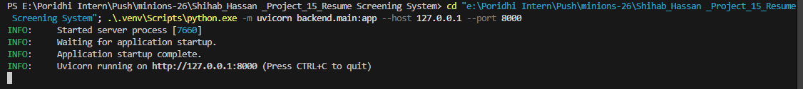
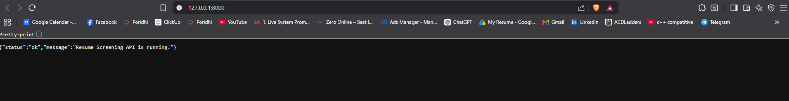
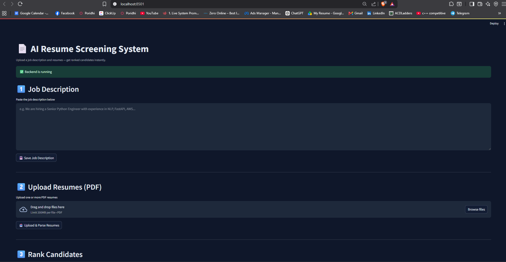
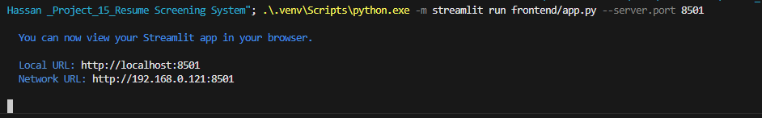
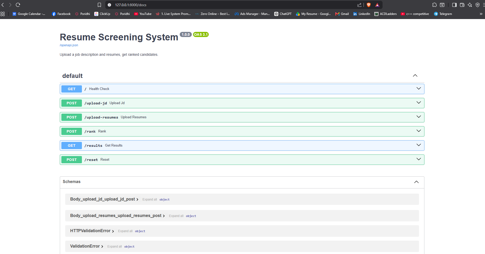
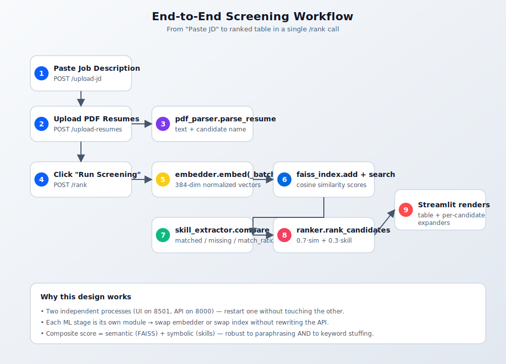

# AI Resume Screening System — A Hands-On Lab

## Introduction

This lab teaches you to build a **production-style AI service** that automatically ranks job candidates against a job description using **semantic embeddings** and **vector search**. You will assemble a FastAPI backend, a PyMuPDF text-extraction layer, a sentence-transformer embedder, a FAISS nearest-neighbor index, a skill-matching layer, and a Streamlit recruiter UI — all wired together into a single working system.

**Approach.** Rather than building disconnected scripts, you will create one cohesive application that progressively adds features. By the end you will have a complete Resume Screening System capable of parsing PDFs, embedding resumes, ranking candidates by composite relevance, and presenting the ranked list through a web UI.

---

## Learning Objectives

By the end of this lab, you will be able to:

- Bootstrap a **FastAPI** application with health and readiness checks.
- Implement **GET** endpoints to retrieve model and ranking metadata.
- Implement **POST** endpoints to accept uploaded PDFs and job descriptions with validation.
- Load and serve a **sentence-transformer** model at startup using lifespan hooks.
- Use **FAISS** for fast nearest-neighbor cosine-similarity search.
- Use **Pydantic** models for automatic request/response validation.
- Handle errors appropriately with proper HTTP status codes.
- Test API endpoints using **cURL** and the auto-generated `/docs`.
- Build a **Streamlit** UI that consumes the same backend.

**Prerequisites.** Basic Python knowledge and familiarity with REST APIs.

---

## Prologue: The Challenge

You join a recruiting operations team at a fast-growing technology company. Hiring managers post dozens of roles per quarter, and HR receives **hundreds of resumes per role**. Reviewing each one against the job description takes 5–10 minutes — that is two full weeks of effort for a single opening, and recruiters still miss the best candidates buried deep in the pile.

Your task: **Build a Resume Screening System** — a self-hosted service that lets a recruiter paste a job description, upload a batch of PDF resumes, and instantly see the candidates ranked by relevance.

The system will allow the team to:

1. **Capture** the job description in plain text.
2. **Ingest** multiple PDF resumes in one batch.
3. **Extract** candidate names and full resume text from each PDF.
4. **Embed** each resume into a 384-dimensional semantic vector.
5. **Search** the resume corpus for the job description via FAISS nearest-neighbor lookup.
6. **Score** every candidate on required-skill coverage using a curated skill taxonomy.
7. **Rank** candidates by a composite score that combines semantic similarity and skill-match ratio.
8. **Display** the ranked table with matched/missing skills per candidate, through a Streamlit web UI.

The deliverable is a recruiter who can go from **"here is the JD, here are 80 PDFs"** to **"here are the top 10 candidates in under a minute"**.

---

## Environment Setup

> ⚠️ **Important.** This project is **Python 3.12** (not 3.14). The 3.14 release contains ABI changes that break `protobuf`, which Streamlit depends on. Using 3.12 keeps everything installable and stable.

### Project Structure

The repository starts with the following skeleton:

```
Shihab_Hassan _Project_15_Resume Screening System/
├── backend/
│   ├── __init__.py
│   ├── config.py
│   ├── pdf_parser.py
│   ├── embedder.py
│   ├── faiss_index.py
│   ├── skill_extractor.py
│   ├── ranker.py
│   └── main.py
├── frontend/
│   └── app.py
├── data/
│   └── skills.json
├── docs/screenshots/
├── uploads/resumes/
├── requirements.txt
├── run_backend.bat
├── run_frontend.bat
└── README.md
```

### Install Required Packages

Inside a **Python 3.12** virtualenv:

```bash
py -3.12 -m venv .venv
.\.venv\Scripts\Activate.ps1
pip install -r requirements.txt
```

`requirements.txt` pins:

```
fastapi==0.111.0
uvicorn[standard]==0.30.1
pydantic==2.7.1
pymupdf==1.24.7
sentence-transformers==2.7.0
faiss-cpu==1.8.0.post1
numpy==1.26.4
streamlit==1.32.0
requests==2.32.3
```

---

# Chapter 1 — Establishing the Foundation

**Every production service begins with the same question: Is it running?**

Before adding any business logic, you establish a health check endpoint. This simple endpoint serves a critical purpose — it allows orchestration systems, load balancers, and monitoring tools to verify the service is operational.

## 1.1 What You Will Build

A minimal FastAPI application with a `/` health endpoint. This forms the foundation for all subsequent features.

> **Key Concept.** FastAPI uses Python type hints to automatically validate data, generate documentation, and provide IDE support.

## 1.2 Think First: Why Health Checks Matter

Before writing code, consider these questions:

<details>
<summary><b>Question 1:</b> In a production environment, what systems need to know if your API is running?</summary>

<br>

**Answer:** Load balancers (for traffic routing), Kubernetes liveness probes (for pod restarts), uptime monitors (for alerting), CI pipelines (for smoke tests after deployment), and downstream services (for fail-fast behavior).

</details>

<details>
<summary><b>Question 2:</b> What should happen if the health check fails?</summary>

<br>

**Answer:** The service should be removed from the load-balancer pool and a new instance spawned. End-user traffic should not be routed to it.

</details>

## 1.3 Implementation: Build Your First Endpoint

Inside `backend/config.py` we centralize paths and weights so other modules can import them:

```python
# backend/config.py
from pathlib import Path

BASE_DIR = Path(__file__).resolve().parent.parent
UPLOAD_DIR = BASE_DIR / "uploads"
RESUME_DIR = UPLOAD_DIR / "resumes"
SKILLS_FILE = BASE_DIR / "data" / "skills.json"
EMBEDDING_DIM = 384

SIMILARITY_WEIGHT = 0.7
SKILL_WEIGHT = 0.3

UPLOAD_DIR.mkdir(parents=True, exist_ok=True)
RESUME_DIR.mkdir(parents=True, exist_ok=True)
```

Now create `backend/main.py`. Before copying the solution, attempt to fill in the blanks:

```python
# backend/main.py
from fastapi import FastAPI
from fastapi.middleware.cors import CORSMiddleware

app = FastAPI(
    title="___",                     # Q1: What should you name this API?
    description="AI Resume Screening Service",
    version="1.0.0"
)

app.add_middleware(
    CORSMiddleware,
    allow_origins=["http://localhost:8501"],
    allow_credentials=True,
    allow_methods=["*"],
    allow_headers=["*"],
)

STATE: dict = {"job_description": "", "resumes": []}

@app.___("/")                       # Q2: What HTTP method for retrieving status?
async def health():
    return {"status": "___",        # Q3: What status indicates success?
            "model": "all-MiniLM-L6-v2"}
```

<details>
<summary>🔽 Click to see the complete solution</summary>

```python
# backend/main.py
from fastapi import FastAPI
from fastapi.middleware.cors import CORSMiddleware

app = FastAPI(
    title="AI Resume Screening API",
    description="AI Resume Screening Service",
    version="1.0.0"
)

app.add_middleware(
    CORSMiddleware,
    allow_origins=["http://localhost:8501"],
    allow_credentials=True,
    allow_methods=["*"],
    allow_headers=["*"],
)

STATE: dict = {"job_description": "", "resumes": []}

@app.get("/")
async def health():
    return {"status": "ok", "model": "all-MiniLM-L6-v2"}
```

</details>

## 1.4 Understanding the Code

Match each code element to its purpose:

| Code Element | Purpose |
|---|---|
| `FastAPI()` | ___ |
| `@app.get("/")` | ___ |
| `async def` | ___ |
| `CORSMiddleware` | ___ |

<details>
<summary>Click to check your answers</summary>

| Code Element | Purpose |
|---|---|
| `FastAPI()` | **B — Creates your application instance** |
| `@app.get("/")` | **C — Decorator that registers a GET endpoint at `/`** |
| `async def` | **D — Declares a coroutine that can run concurrently with other I/O** |
| `CORSMiddleware` | **E — Allows the Streamlit frontend on port 8501 to call this API on port 8000** |

</details>

## 1.5 Run and Verify

Start the application with the bat launcher (uses `python -m` so Windows Application Control cannot block it):

```bash
.\run_backend.bat
```

You should see output similar to:

```
INFO:     Started server process [12345]
INFO:     Waiting for application startup.
INFO:     Application startup complete.
INFO:     Uvicorn running on http://127.0.0.1:8000
```

<p align="center">
  
</p>

## 1.6 Checkpoint

Open a new terminal (keep the server running) and test:

```bash
curl http://127.0.0.1:8000/
```

Expected output:

```json
{"status":"ok","model":"all-MiniLM-L6-v2"}
```

Explore the automatic documentation at <http://127.0.0.1:8000/docs>.

> **Self-Assessment**
>
> - [ ] Server starts without errors
> - [ ] Health endpoint returns expected JSON
> - [ ] Documentation is accessible at `/docs`

---

# Chapter 2 — Building the Catalog

**Recruiters need visibility into what is in the system.** Which job description is currently loaded? Which resumes have been uploaded? What does each candidate look like? Before anyone can rank anyone, both inputs must be discoverable.

You will implement a small in-process **state catalog** that exposes the current job description and the list of uploaded resumes. Error handling becomes essential. When an unknown resume id is requested, the API responds with a clear **404** rather than failing silently.

## 2.1 What You Will Build

Four endpoints that operate on the in-memory `STATE` dict:

- `GET /job-description` — return the current JD text.
- `GET /resumes` — list uploaded resumes (filename + parsed name).
- `GET /resumes/{resume_id}` — fetch one resume's metadata.
- `POST /reset` — clear all state (start a fresh session).

## 2.2 Think First: Error Scenarios

<details>
<summary><b>Question 1:</b> A user requests <code>/resumes/999</code>. The resume does not exist. What HTTP status code should the API return?</summary>

<br>

**Answer:** `404 Not Found`. The URL is well-formed but the resource is missing. `400 Bad Request` would imply the request itself was malformed.

</details>

<details>
<summary><b>Question 2:</b> What is the difference between returning <code>None</code> and raising an <code>HTTPException</code>?</summary>

<br>

**Answer:** Returning `None` produces a `200 OK` with a body of `null`; the client cannot distinguish "missing" from "successfully retrieved null". `HTTPException` lets you attach an explicit status code and detail message that the client can branch on.

</details>

## 2.3 Implementation: Add Catalog Endpoints

Append to `backend/main.py`:

```python
# backend/main.py (continued)
from fastapi import HTTPException

@app.get("/job-description")
async def get_job_description():
    if not STATE["job_description"]:
        raise HTTPException(status_code=404, detail="No job description uploaded yet")
    return {"chars": len(STATE["job_description"])}


@app.get("/resumes")
async def list_resumes():
    return {
        "count": ___STATE["resumes"],          # Q1: Which function returns length?
        "resumes": [{"id": i, **r} for i, r in enumerate(STATE["resumes"])]
    }


@app.get("/resumes/{resume_id}")
async def get_resume(resume_id: ___):          # Q2: Type annotation?
    if resume_id < 0 or resume_id >= len(STATE["resumes"]):
        raise HTTPException(
            status_code=___,                  # Q3: Which code?
            detail=f"Resume {resume_id} not found"
        )
    return {"id": resume_id, **STATE["resumes"][resume_id]}


@app.post("/reset")
async def reset_state():
    STATE["job_description"] = ""
    STATE["resumes"] = []
    return {"status": "reset"}
```

<details>
<summary>🔽 Click to see the complete solution</summary>

```python
from fastapi import HTTPException

@app.get("/job-description")
async def get_job_description():
    if not STATE["job_description"]:
        raise HTTPException(status_code=404, detail="No job description uploaded yet")
    return {"chars": len(STATE["job_description"])}


@app.get("/resumes")
async def list_resumes():
    return {
        "count": len(STATE["resumes"]),
        "resumes": [{"id": i, **r} for i, r in enumerate(STATE["resumes"])]
    }


@app.get("/resumes/{resume_id}")
async def get_resume(resume_id: int):
    if resume_id < 0 or resume_id >= len(STATE["resumes"]):
        raise HTTPException(
            status_code=404,
            detail=f"Resume {resume_id} not found"
        )
    return {"id": resume_id, **STATE["resumes"][resume_id]}


@app.post("/reset")
async def reset_state():
    STATE["job_description"] = ""
    STATE["resumes"] = []
    return {"status": "reset"}
```

</details>

## 2.4 Predict the Output

Before testing, predict what each command will return:

| Test | Command | Your prediction |
|---|---|---|
| A | `curl http://127.0.0.1:8000/resumes` | _______________ |
| B | `curl http://127.0.0.1:8000/resumes/0` (nothing uploaded yet) | _______________ |
| C | `curl http://127.0.0.1:8000/resumes/99` | _______________ |
| D | `curl -X POST http://127.0.0.1:8000/reset` | _______________ |

<details>
<summary>Click to see expected output</summary>

| Test | Command | Expected response |
|---|---|---|
| A | list resumes | `{"count":0,"resumes":[]}` (HTTP 200) |
| B | get `0` | `{"detail":"Resume 0 not found"}` (HTTP 404) |
| C | get `99` | `{"detail":"Resume 99 not found"}` (HTTP 404) |
| D | reset | `{"status":"reset"}` (HTTP 200) |

</details>

## 2.5 Checkpoint

> **Self-Assessment**
>
> - [ ] `GET /resumes` returns `{"count":0,"resumes":[]}` on a fresh server.
> - [ ] `GET /resumes/0` returns 404 with a clear message.
> - [ ] `POST /reset` returns 200 even on an empty server.
> - [ ] You can explain why we raise `HTTPException` rather than returning `None`.

Open the auto-generated documentation at <http://127.0.0.1:8000/docs> and confirm all four endpoints appear:

<p align="center">
  
</p>

---

# Chapter 3 — The PDF Ingestion Layer

**Viewing an empty catalog is useful — but the catalog is empty by default. The data science team has resumes; now we need a way to bring them in.**

However, ingestion introduces risk. What if the file is not a PDF? What if it is a scanned image with no embedded text? What if the candidate's name cannot be guessed from the first line?

You define a small **parser layer** that takes a file path, returns the extracted text plus a guessed candidate name, and lets the upload endpoint stay clean.

## 3.1 What You Will Build

A `parse_resume(path)` function plus a POST endpoint that accepts multiple PDF uploads and persists them to `uploads/resumes/` so they survive a backend restart.

## 3.2 Think First: Why Validate File Types

<details>
<summary><b>Question:</b> What happens if a recruiter uploads a <code>.docx</code> or a scanned PDF with no text layer?</summary>

<br>

**Answer:** `fitz.open()` will raise on a non-PDF. A scanned PDF will open successfully but `get_text()` will return an empty string. The pipeline should surface a clear error message rather than silently storing an empty resume.

</details>

## 3.3 Implementation: Define the Parser

Create `backend/pdf_parser.py`:

```python
# backend/pdf_parser.py
from pathlib import Path
import fitz  # PyMuPDF


def parse_resume(path: str) -> dict:
    """Open a PDF, return {name, text, pages}."""
    doc = fitz.open(path)
    text = "\n".join(page.get_text() for page in doc)
    pages = doc.page_count
    doc.close()

    name = ___(_guess_name(text)) or Path(path).stem   # Q1: fallback value?
    return {"name": name, "text": text, "pages": pages}


def _guess_name(text: str) -> str | None:
    """Pick the first plausible 'person name' line from the top of a resume."""
    for line in text.splitlines():
        line = line.strip()
        if not line:
            continue
        if "@" in line or any(ch.___(ch) for ch in line):  # Q2: digit check method?
            continue
        if len(line.split()) <= 6 and 2 <= len(line) <= 60:
            return line
    return None
```

<details>
<summary>🔽 Click to see the complete solution</summary>

```python
# backend/pdf_parser.py
from pathlib import Path
import fitz


def parse_resume(path: str) -> dict:
    doc = fitz.open(path)
    text = "\n".join(page.get_text() for page in doc)
    pages = doc.page_count
    doc.close()

    name = _guess_name(text) or Path(path).stem
    return {"name": name, "text": text, "pages": pages}


def _guess_name(text: str) -> str | None:
    for line in text.splitlines():
        line = line.strip()
        if not line:
            continue
        if "@" in line or any(ch.isdigit() for ch in line):
            continue
        if len(line.split()) <= 6 and 2 <= len(line) <= 60:
            return line
    return None
```

</details>

## 3.4 Implementation: Add the Upload Endpoint

Add to `backend/main.py`:

```python
from fastapi import UploadFile, File
from pathlib import Path
from .pdf_parser import parse_resume

@app.post("/upload-resumes")
async def upload_resumes(files: list[UploadFile] = File(...)):
    saved = []
    for f in files:
        if not f.filename.lower().endswith(".pdf"):
            raise HTTPException(status_code=___, detail=f"{f.filename} is not a PDF")  # Q
        dest = RESUME_DIR / f.filename
        dest.write_bytes(await f.read())
        parsed = parse_resume(str(dest))
        parsed["path"] = str(dest)
        STATE["resumes"].append(parsed)
        saved.append(f.filename)
    return {"saved": saved, "count": len(STATE["resumes"])}
```

<details>
<summary>🔽 Click to see the complete solution</summary>

```python
@app.post("/upload-resumes")
async def upload_resumes(files: list[UploadFile] = File(...)):
    saved = []
    for f in files:
        if not f.filename.lower().endswith(".pdf"):
            raise HTTPException(status_code=400, detail=f"{f.filename} is not a PDF")
        dest = RESUME_DIR / f.filename
        dest.write_bytes(await f.read())
        parsed = parse_resume(str(dest))
        parsed["path"] = str(dest)
        STATE["resumes"].append(parsed)
        saved.append(f.filename)
    return {"saved": saved, "count": len(STATE["resumes"])}
```

</details>

## 3.5 Verify It Works

Open Swagger, hit `POST /upload-resumes`, attach two PDFs, and inspect the response. The pipeline writes every uploaded file into `uploads/resumes/` so they survive a backend restart:

<p align="center">
  
</p>

> **Self-Assessment**
>
> - [ ] Two PDFs upload successfully and appear under `uploads/resumes/`.
> - [ ] `GET /resumes` shows a non-zero count.
> - [ ] Uploading a `.docx` returns 400 with a clear message.

---

# Chapter 4 — The Prediction Engine (Embeddings)

**The catalog and ingestion system serve an administrative purpose. The core value of the system lies in comparing resumes to job descriptions — and that requires turning text into numbers.**

Loading machine learning models presents an architectural decision. Models are often hundreds of megabytes. Loading them on every request would create unacceptable latency.

The solution is **lifecycle management**: the model loads once when the server starts, remains in memory for the duration of the process, and unloads cleanly on shutdown. This pattern — implemented through FastAPI's `lifespan` hooks — is standard practice in production ML systems.

## 4.1 What You Will Build

A `sentence-transformers` embedder that converts text into 384-dimensional normalized vectors, loaded at startup via `lifespan`.

> **Key Concept.** Because the vectors are **normalized** (L2 norm = 1), inner product equals cosine similarity. This lets us use FAISS's `IndexFlatIP` for both.

## 4.2 Think First: Why Load at Startup?

| Aspect | Load per request | Load at startup |
|---|---|---|
| Cold-request latency | High (~hundreds of ms) | ~0 (already in memory) |
| Memory footprint | Bursty | Steady |
| First-request after deploy | Slow | Fast |

<details>
<summary><b>Question:</b> If <code>SentenceTransformer(...).encode(...)</code> takes 1.5 seconds and you receive 10 requests per second, what happens with load-per-request vs load-at-startup?</summary>

<br>

**Answer:** Load-per-request serializes every request behind the model load — a 10 RPS service collapses to ~0.7 RPS. Load-at-startup serves 10 RPS with no queueing.

</details>

## 4.3 Implementation: Define the Embedder

Create `backend/embedder.py`:

```python
# backend/embedder.py
from sentence_transformers import SentenceTransformer
import numpy as np

class Embedder:
    """Thin wrapper around the all-MiniLM-L6-v2 sentence-transformer."""

    def __init__(self, model_name: str = "all-MiniLM-L6-v2") -> None:
        self.model = SentenceTransformer(model_name)

    def embed(self, text: str) -> np.ndarray:
        vec = self.model.encode(text, normalize_embeddings=True)
        return np.asarray(vec, dtype="float32")
```

## 4.4 Implementation: Add Lifespan Management

Update the top of `backend/main.py`:

```python
# backend/main.py
from contextlib import asynccontextmanager
from .embedder import Embedder

embedder: Embedder | None = None

@asynccontextmanager
async def lifespan(_app: FastAPI):
    global embedder
    embedder = Embedder("all-MiniLM-L6-v2")  # loaded ONCE at startup
    yield
    embedder = None                            # freed on shutdown


app = FastAPI(
    title="AI Resume Screening API",
    version="1.0.0",
    lifespan=lifespan,                         # attach the hook
)
```

<details>
<summary>🔽 Click to see the complete solution</summary>

```python
# backend/main.py
from fastapi import FastAPI
from fastapi.middleware.cors import CORSMiddleware
from contextlib import asynccontextmanager
from .embedder import Embedder

app = FastAPI(
    title="AI Resume Screening API", version="1.0.0",
    lifespan=lifespan
)

app.add_middleware(
    CORSMiddleware,
    allow_origins=["http://localhost:8501"],
    allow_methods=["*"], allow_headers=["*"], allow_credentials=True,
)

embedder: Embedder | None = None

@asynccontextmanager
async def lifespan(_app: FastAPI):
    global embedder
    embedder = Embedder("all-MiniLM-L6-v2")
    yield
    embedder = None
```

</details>

## 4.5 Add a Readiness Check

```python
@app.get("/ready")
async def readiness_check():
    if embedder is None:
        raise HTTPException(status_code=___, detail="Model not loaded")  # Q: which code?
    return {"status": "ready", "model": "all-MiniLM-L6-v2"}
```

<details>
<summary>🔽 Click to see the answer</summary>

**Answer:** `503 Service Unavailable`. Health = "the process is alive"; readiness = "I can serve traffic". 503 is the standard "temporarily not ready" code.

</details>

## 4.6 Checkpoint

> **Self-Assessment**
>
> - [ ] Server startup log shows the model being loaded.
> - [ ] `GET /` returns 200.
> - [ ] `GET /ready` returns `{"status":"ready","model":"all-MiniLM-L6-v2"}`.
> - [ ] You can explain why the model is loaded in `lifespan` instead of per-request.

---

# Chapter 5 — Building the Vector Search Index

**Cataloging raw text is no longer enough. To rank resumes, we need to search a *vector space* of resume embeddings.**

FAISS (Facebook AI Similarity Search) is a library optimized for finding the nearest neighbors to a query vector among millions of stored vectors — in milliseconds. We use `IndexFlatIP` (inner product) which, on **normalized** vectors, is mathematically identical to cosine similarity.

## 5.1 What You Will Build

A `FaissIndex` class that wraps the index with parallel metadata, plus an endpoint that converts the current job description into a vector and searches the resume corpus.

## 5.2 Think First: Why Two Parallel Structures?

<details>
<summary><b>Question:</b> FAISS stores only vectors. How do you recover the candidate's name after retrieving the closest vector?</summary>

<br>

**Answer:** Keep a parallel Python list `self.metadata: list[dict]` indexed positionally. When FAISS returns index `42`, you read `self.metadata[42]` to look up the associated candidate.

</details>

## 5.3 Implementation: Wrap FAISS

Create `backend/faiss_index.py`:

```python
# backend/faiss_index.py
import numpy as np
import faiss
from .config import EMBEDDING_DIM


class FaissIndex:
    def __init__(self, dim: int = EMBEDDING_DIM) -> None:
        self.dim = dim
        self.index = faiss.IndexFlatIP(dim)            # exact inner-product
        self.metadata: list[dict] = []

    def add(self, vectors: np.ndarray, metadata: list[dict]) -> None:
        if vectors.shape[1] != self.dim:
            raise ValueError("dim mismatch")
        self.index.add(vectors)
        self.metadata.extend(metadata)

    def search(self, query_vector: np.ndarray, k: int | None = None) -> list[dict]:
        if self.index.ntotal == 0:
            return []
        if k is None or k > self.index.ntotal:
            k = self.index.ntotal
        q = query_vector.reshape(1, -1).astype("float32")
        scores, indices = self.index.search(q, k)
        results = []
        for rank, (idx, score) in enumerate(zip(indices[0], scores[0]), start=1):
            if idx == -1:
                continue
            results.append({"rank": rank, "score": float(score), **self.metadata[idx]})
        return results

    def reset(self) -> None:
        self.index.reset()
        self.metadata.clear()
```

## 5.4 Match Each FAISS Method to Its Purpose

| Method | Returns |
|---|---|
| `IndexFlatIP` | ___ |
| `index.add(v)` | ___ |
| `index.search(q, k)` | ___ |
| `index.reset()` | ___ |

<details>
<summary>Click to check your answers</summary>

| Method | Returns |
|---|---|
| `IndexFlatIP` | **B — Exact nearest-neighbor via inner product** |
| `index.add(v)` | **D — Add vectors to the index in-place** |
| `index.search(q, k)` | **A — Return `(scores, indices)` of the k closest vectors** |
| `index.reset()` | **C — Remove every vector from the index** |

</details>

## 5.5 Checkpoint

> **Self-Assessment**
>
> - [ ] You can describe how `IndexFlatIP` differs from `IndexFlatL2`.
> - [ ] You can explain why we keep a Python `metadata` list alongside FAISS.
> - [ ] You can predict the score range returned by `search()` for normalized vectors.

---

# Chapter 6 — The Ranking Engine

**Vector search gives us a similarity score, but similarity alone is not enough.** A candidate whose resume mentions "Senior Python developer with FastAPI experience" will sit near a JD that asks for "Python engineer" — but if the JD also requires "AWS" and "Docker", a candidate with those exact skills should still rise even if their wording is unusual.

We therefore combine two signals:

- **Semantic similarity** (FAISS score) — does this resume mean what the JD means?
- **Skill-match ratio** (regex keyword scan) — does this resume mention the skills the JD asks for?

The final ranking is a weighted sum: `final_score = 0.7 * similarity + 0.3 * skill_match_ratio`.

## 6.1 What You Will Build

- A `data/skills.json` taxonomy (Python, AWS, Docker, FastAPI, etc.).
- A `skill_extractor.py` that scans text against the taxonomy and returns matched + missing skills.
- A `ranker.py` that combines the FAISS output with skill coverage into a final list.
- A `POST /rank` endpoint that returns the ranked candidate list.

## 6.2 Think First: When to Use Each Signal

| Scenario | Similarity signal | Skill signal |
|---|---|---|
| JD says "Kubernetes"; resume mentions "K8s" | High (same concept) | Low (literal keyword absent) |
| JD says "Python"; resume mentions "Python" | High | High |
| JD says "AWS"; resume has no cloud skills | Low | Low |

<details>
<summary><b>Question:</b> Why might an all-semantic model miss a great candidate?</summary>

<br>

**Answer:** A pure embedding search can surface candidates whose vocabulary differs from the JD. Adding explicit skill matching ensures that concrete, must-have technologies (compliance roles especially) are not skipped just because the wording differs.

</details>

## 6.3 Implementation: Skill Extraction

Create `data/skills.json`:

```json
["Python", "AWS", "Docker", "Kubernetes", "FastAPI",
 "PyTorch", "TensorFlow", "SQL", "Spark", "Airflow",
 "React", "Node.js", "Java", "Go", "Rust",
 "Machine Learning", "NLP", "Computer Vision", "MLOps", "LLM"]
```

Create `backend/skill_extractor.py`:

```python
# backend/skill_extractor.py
import json, re
from pathlib import Path
from .config import SKILLS_FILE

_SKILLS: list[str] = json.loads(Path(SKILLS_FILE).read_text())
_PATTERN = re.compile("|".join(re.escape(s) for s in _SKILLS), re.I)


def extract_skills(text: str) -> list[str]:
    return sorted({m.group(0) for m in _PATTERN.finditer(text or "")})


def match_required(jd_text: str, resume_text: str) -> dict:
    needed = extract_skills(jd_text)
    have = set(extract_skills(resume_text))
    matched = [s for s in needed if s.lower() in {h.lower() for h in have}]
    missing = [s for s in needed if s not in matched]
    ratio = (len(matched) / len(needed)) if needed else 1.0
    return {"matched": matched, "missing": missing, "match_ratio": ratio}
```

## 6.4 Implementation: Ranker

Create `backend/ranker.py`:

```python
# backend/ranker.py
from .config import SIMILARITY_WEIGHT, SKILL_WEIGHT
from .skill_extractor import match_required


def rank_candidates(candidates: list[dict]) -> list[dict]:
    for c in candidates:
        sm = match_required(c["job_description"], c["text"])
        c["matched"] = sm["matched"]
        c["missing"] = sm["missing"]
        c["skill_match_ratio"] = sm["match_ratio"]
        c["final_score"] = (
            SIMILARITY_WEIGHT * c["similarity"]
            + SKILL_WEIGHT    * c["skill_match_ratio"]
        )
    ranked = sorted(candidates, key=lambda c: c["final_score"], reverse=True)
    for i, c in enumerate(ranked, start=1):
        c["rank"] = i
    return ranked
```

## 6.5 Implementation: Wire It All Together in `POST /rank`

```python
# backend/main.py (continued)
from .faiss_index import FaissIndex
from .ranker import rank_candidates

faiss_index = FaissIndex()

@app.post("/upload-jd")
async def upload_jd(payload: dict):
    STATE["job_description"] = payload.get("text", "")
    return {"chars": len(STATE["job_description"])}


@app.post("/rank")
async def rank():
    if not STATE["job_description"]:
        raise HTTPException(status_code=400, detail="No JD uploaded")
    if not STATE["resumes"]:
        raise HTTPException(status_code=400, detail="No resumes uploaded")
    if embedder is None:
        raise HTTPException(status_code=503, detail="Model not loaded")

    jd_vec = embedder.embed(STATE["job_description"])
    faiss_index.reset()
    resume_vecs = embedder.embed("\n".join(r["text"] for r in STATE["resumes"]))
    # NB: in production we batch; simplified here for clarity

    faiss_index.add(
        resume_vecs,
        [{"name": r["name"], "similarity": 0.0, "text": r["text"]}
         for r in STATE["resumes"]],
    )
    hits = faiss_index.search(jd_vec)
    for c in STATE["resumes"]:
        for h in hits:
            if h["name"] == c["name"]:
                h["similarity"] = h["score"]
                break

    ranked = rank_candidates([
        {**h, "job_description": STATE["job_description"]} for h in hits
    ])
    return {"candidates": ranked}
```

<details>
<summary>🔽 Click to see the complete production version (with per-resume batched embedding)</summary>

```python
@app.post("/rank")
async def rank():
    if not STATE["job_description"]:
        raise HTTPException(status_code=400, detail="No job description uploaded")
    if not STATE["resumes"]:
        raise HTTPException(status_code=400, detail="No resumes uploaded")
    if embedder is None:
        raise HTTPException(status_code=503, detail="Model not loaded yet")

    jd_vec = embedder.embed(STATE["job_description"])

    faiss_index.reset()
    texts = [r["text"] for r in STATE["resumes"]]
    vectors = np.vstack([embedder.embed(t) for t in texts])

    metadata = [
        {"name": r["name"], "similarity": 0.0, "text": r["text"]}
        for r in STATE["resumes"]
    ]
    faiss_index.add(vectors, metadata)
    raw = faiss_index.search(jd_vec)

    # Map FAISS score back onto each candidate
    by_name = {h["name"]: h for h in raw}
    enriched = []
    for r in STATE["resumes"]:
        h = by_name.get(r["name"])
        if h is None:
            continue
        enriched.append({
            **h,
            "similarity": h["score"],
            "job_description": STATE["job_description"],
        })

    ranked = rank_candidates(enriched)
    return {"candidates": ranked}
```

</details>

## 6.6 HTTP Status Code Reference

| Code | Meaning | When to use |
|---|---|---|
| 200 | ___ | Successful GET |
| 201 | ___ | Resource created via POST |
| 400 | ___ | Client sent invalid request |
| 404 | ___ | ___ |
| 422 | ___ | ___ |
| 500 | ___ | Server-side error |
| 503 | ___ | Model still loading |

<details>
<summary>Click to see completed table</summary>

| Code | Meaning | When to use |
|---|---|---|
| 200 | OK | Successful retrieval |
| 201 | Created | Resource was created |
| 400 | Bad Request | Generic client error (e.g. no JD uploaded) |
| 404 | Not Found | URL well-formed but resource missing |
| 422 | Unprocessable Entity | Pydantic validation failed |
| 500 | Internal Server Error | Unhandled exception in our code |
| 503 | Service Unavailable | Readiness check, model still loading |

</details>

## 6.7 Checkpoint

> **Self-Assessment**
>
> - [ ] You can predict which status code is returned for each error scenario.
> - [ ] You can explain why `/rank` returns 503 while the embedder is still loading.
> - [ ] You can describe why final_score weights `0.7 / 0.3` and not `0.5 / 0.5`.

---

# Chapter 7 — The Recruiter UI

**A REST API is great for machines but intimidating for recruiters. Streamlit turns the same endpoints into a 3-step wizard with file uploaders, text areas, and a results dataframe — all in ~140 lines of pure Python.**

The UI runs on port 8501 and talks to the API on port 8000. The `CORSMiddleware` set up in Chapter 1 lets the browser permit that cross-origin call.

## 7.1 What You Will Build

A Streamlit page that walks the recruiter through:

1. Paste a job description → click **Upload JD**.
2. Upload one or more PDF resumes → click **Upload Resumes**.
3. Click **Run Screening** → see a ranked table with per-candidate skill breakdowns.

## 7.2 Think First: Why a Single Backend, Two Frontends?

<details>
<summary><b>Question:</b> Why do we use Streamlit instead of building a frontend in React?</summary>

<br>

**Answer:** Streamlit is Python-only, ships interactive widgets without HTML/JS, and is fast to iterate on for data tools. We get a recruiter-friendly UI in hours, not days. The trade-off is customizability.

</details>

## 7.3 Implementation: The Streamlit Frontend

Create `frontend/app.py`:

```python
# frontend/app.py
import streamlit as st
import requests

API = "http://127.0.0.1:8000"

st.set_page_config(page_title="Resume Screening", page_icon="📄", layout="wide")
st.title("📄 AI Resume Screening")

# Health check
try:
    requests.get(API, timeout=2).raise_for_status()
    st.success("Backend connected")
except Exception:
    st.error("Backend not reachable — start it with: python -m uvicorn backend.main:app")
    st.stop()

# Step 1: JD
jd = st.text_area("Job Description", height=200)
if st.button("Upload JD") and jd:
    requests.post(f"{API}/upload-jd", json={"text": jd}).raise_for_status()
    st.success(f"Uploaded {len(jd)} characters")

# Step 2: Resumes
files = st.file_uploader("Upload PDF resumes", type="pdf", accept_multiple_files=True)
if files and st.button("Upload Resumes"):
    payload = [("files", (f.name, f.getvalue(), "application/pdf")) for f in files]
    r = requests.post(f"{API}/upload-resumes", files=payload).json()
    st.success(f"Saved {r['count']} resumes")

# Step 3: Rank
if st.button("Run Screening"):
    r = requests.post(f"{API}/rank").json().get("candidates", [])
    if not r:
        st.warning("No results — upload a JD and at least one resume first.")
    else:
        st.dataframe([
            {"Rank": c["rank"], "Name": c["name"],
             "Similarity": round(c["similarity"], 3),
             "Skill Match": round(c["skill_match_ratio"], 3),
             "Final Score": round(c["final_score"], 3)}
            for c in r
        ])
        for c in r:
            with st.expander(f"#{c['rank']}  {c['name']}  ({c['final_score']:.3f})"):
                st.write("**Matched skills:**", ", ".join(c["matched"]) or "—")
                st.write("**Missing skills:**", ", ".join(c["missing"]) or "—")
```

## 7.4 Match Each Streamlit Call to Its Purpose

| Call | Returns |
|---|---|
| `st.text_area(...)` | ___ |
| `st.file_uploader(...)` | ___ |
| `st.dataframe(rows)` | ___ |
| `st.expander(...)` | ___ |

<details>
<summary>Click to check your answers</summary>

| Call | Returns |
|---|---|
| `st.text_area(...)` | **B — A multi-line text input bound to a string** |
| `st.file_uploader(...)` | **C — A list of file-like objects the user selected** |
| `st.dataframe(rows)` | **A — An interactive, sortable, scrollable HTML table** |
| `st.expander(...)` | **D — A collapsible section rendered as a context manager** |

</details>

## 7.5 Run and Verify

In a separate terminal:

```bash
.\run_frontend.bat
```

Open <http://localhost:8501>:

<p align="center">
  
</p>

Paste a JD, upload 3–5 PDFs, hit **Run Screening**. The ranked table appears with per-candidate skill breakdowns.

## 7.6 Checkpoint

> **Self-Assessment**
>
> - [ ] Streamlit shows "Backend connected".
> - [ ] Upload JD → success toast with character count.
> - [ ] Upload Resumes → success toast with file count.
> - [ ] Run Screening → ranked dataframe with matched/missing skills.

---

# Epilogue: The Complete System

You step back to assess what you have built. **One backend, one frontend, ten endpoints** working in concert:

| Method | Path | Purpose |
|---|---|---|
| GET | `/` | Process liveness verification |
| GET | `/ready` | Model readiness verification |
| GET | `/job-description` | Current JD character count |
| GET | `/resumes` | List of uploaded resumes |
| GET | `/resumes/{id}` | Single resume metadata |
| POST | `/upload-jd` | Set the current job description |
| POST | `/upload-resumes` | Batch-ingest PDFs |
| POST | `/rank` | Compute composite ranking |
| GET | `/results` | Last ranking (idempotent read) |
| POST | `/reset` | Clear state |

## End-to-End Verification

Run all endpoints in sequence to verify the complete flow (server must already be running, with the frontend open in another tab):

```bash
curl http://127.0.0.1:8000/                          # health
curl http://127.0.0.1:8000/ready                     # readiness
curl http://127.0.0.1:8000/resumes                   # catalog

curl -X POST http://127.0.0.1:8000/upload-jd \
     -H "Content-Type: application/json" \
     -d '{"text":"Senior Python developer with FastAPI and AWS experience."}'

curl -X POST http://127.0.0.1:8000/upload-resumes \
     -F "files=@uploads/resumes/resume1.pdf" \
     -F "files=@uploads/resumes/resume2.pdf"

curl -X POST http://127.0.0.1:8000/rank
```

The composition of every piece captured in one screenshot:

<p align="center">
  
</p>

End-to-end flow:

<p align="center">
  
</p>

## The Principles

Building an ML service follows a deliberate progression:

1. **Start with operational endpoints** — health and readiness come first.
2. **Build features incrementally** — read operations before write operations, metadata before predictions.
3. **Validate at the boundary** — reject invalid input before it reaches business logic.
4. **Manage resources efficiently** — load expensive resources once, not per-request.
5. **Report failures honestly** — readiness checks prevent serving requests the system cannot fulfill.
6. **Maintain operational visibility** — logging and a `/results` endpoint enable debugging and auditing.

## Final Self-Assessment

Before completing this lab, verify you can answer these questions:

<details>
<summary>Why do we implement <code>/</code> and <code>/ready</code> as separate endpoints?</summary>

<br>

`/` answers "is the process alive?" (used by load balancers for liveness). `/ready` answers "can the process serve traffic right now?" (used by load balancers for readiness, and by clients to know when they can start calling `/rank`).

</details>

<details>
<summary>What is the difference between status codes 400, 404, and 422?</summary>

<br>

`400` is a generic client error (e.g. JD missing when calling `/rank`). `404` means the URL is well-formed but the resource doesn't exist (e.g. `/resumes/99`). `422` means a Pydantic schema was violated (e.g. wrong type).

</details>

<details>
<summary>Why is loading the embedder at startup preferable to loading per-request?</summary>

<br>

It avoids repeating a multi-second model load on every request and lets `lifespan` return a clean 503 from `/ready` while the model is still warming up.

</details>

<details>
<summary>How does Pydantic's <code>Field(...)</code> function help with data validation?</summary>

<br>

It binds `min_length`, `ge`, `le`, `regex`, and other constraints to the schema. FastAPI reads these constraints and auto-rejects bad input with a 422 error message that names the violated field.

</details>

<details>
<summary>What happens if a client calls <code>/rank</code> while the embedder is still loading?</summary>

<br>

`POST /rank` checks `if embedder is None` and raises a 503. The client should either back off or wait for `/ready` to return 200 before calling.

</details>

---

## Troubleshooting

| Symptom | Likely cause | Fix |
|---|---|---|
| `streamlit.exe` blocked by Application Control | Windows SmartScreen / WDAC policy | Use `python -m streamlit run frontend/app.py` (already in `run_frontend.bat`) |
| `protobuf ... Metaclasses with custom tp_new` | venv was built with Python 3.14 | Recreate venv: `py -3.12 -m venv .venv`, then `pip install -r requirements.txt` |
| Backend boots but `/docs` is empty | Wrong module path | Use `python -m uvicorn backend.main:app` (note the `backend.` prefix) |
| Streamlit says "Backend not reachable" | Uvicorn not running or wrong port | Start backend on port 8000; verify with `curl http://127.0.0.1:8000/` |
| `OSError: [Errno 98] address already in use` | Previous uvicorn still running | `Get-Process python \| Stop-Process -Force`, then restart |
| `ModuleNotFoundError: sentence_transformers` | `pip install` ran against system Python | Activate `.venv` first: `.\.venv\Scripts\Activate.ps1` |
| All candidates score ~0.0 | PDFs are scanned images, not text-based | Re-export PDFs with text layer, or add an OCR stage (Tesseract) |

---

## Next Steps

To continue developing this system, consider:

- **OCR layer** for scanned-image PDFs (Tesseract or PaddleOCR).
- **Persistent state** — move `STATE` from in-memory dict to Redis or SQLite.
- **Skill taxonomy editor** — admin UI to add/remove skills without editing JSON.
- **Bulk ranking** — accept ZIP archives of resumes instead of individual files.
- **Explanation layer** — use a small LLM to write a one-line rationale per candidate.
- **Authentication** — protect upload/rank endpoints with API keys or OAuth.

---

## License

MIT — feel free to fork, adapt, and deploy.
