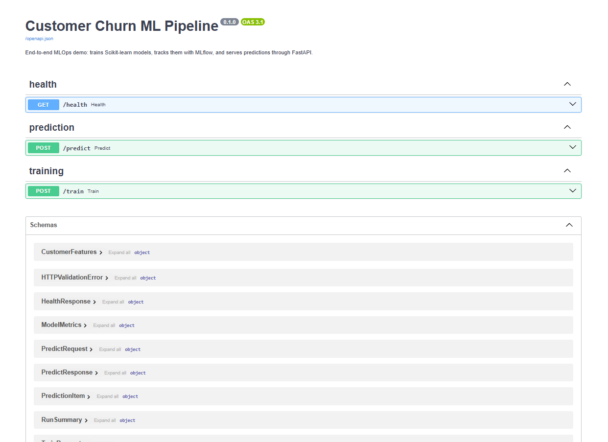
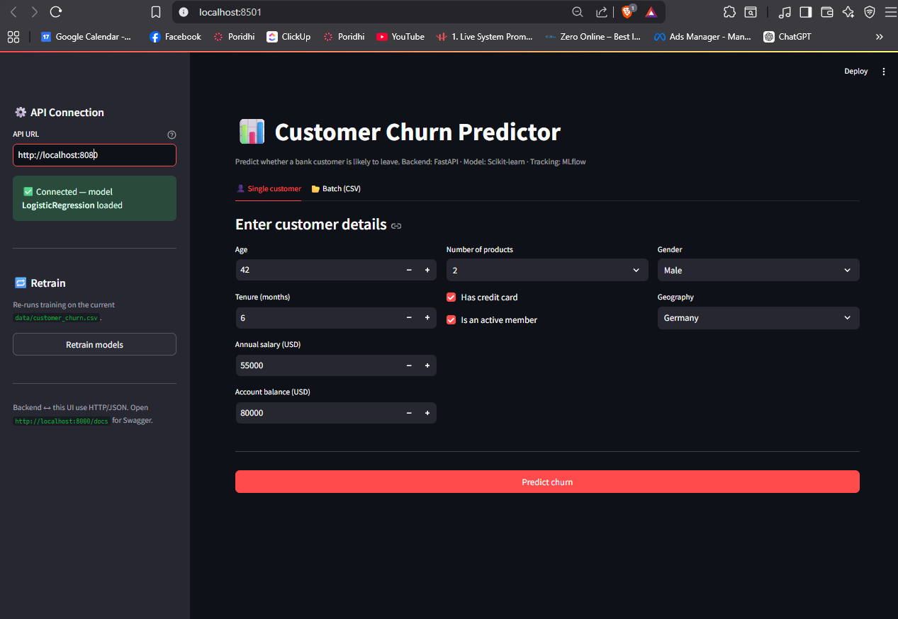

# Customer Churn MLOps Pipeline

A complete, beginner-friendly lab that walks you through building an end-to-end machine-learning system: synthetic data, training, experiment tracking, an API, a UI, and a Docker image. Every code file you need is reproduced in full below, in the order you create it.

---

## Table of Contents

1. [Introduction](#introduction)
2. [Learning Objectives](#learning-objectives)
3. [The Challenge](#the-challenge)
4. [System Architecture](#system-architecture)
5. [Environment Setup](#environment-setup)
6. [Chapter 1 — Synthetic Data Generation](#chapter-1--synthetic-data-generation)
7. [Chapter 2 — Preprocessing and Feature Pipelines](#chapter-2--preprocessing-and-feature-pipelines)
8. [Chapter 3 — Model Training and Tracking](#chapter-3--model-training-and-tracking)
9. [Chapter 4 — Building the Prediction API](#chapter-4--building-the-prediction-api)
10. [Chapter 5 — Building the Streamlit Frontend](#chapter-5--building-the-streamlit-frontend)
11. [Chapter 6 — Containerization and Deployment](#chapter-6--containerization-and-deployment)
12. [Putting It All Together](#putting-it-all-together)
13. [Troubleshooting](#troubleshooting)
14. [Next Steps](#next-steps)
15. [Additional Resources](#additional-resources)

---

## Introduction

This project teaches you to build a working MLOps pipeline from an empty folder. You will:

- Create a deterministic synthetic dataset
- Train two Scikit-learn models
- Log every experiment to MLflow
- Serve predictions through a FastAPI backend
- Drive the backend from a Streamlit dashboard
- Package the whole thing in a Docker container

Each chapter ends with a working file you can run. By the end of Chapter 6 you have a single Docker image that exposes a trained model behind an HTTP API.

## Learning Objectives

After finishing this lab you will be able to:

1. Generate reproducible synthetic data with NumPy and pandas.
2. Build a reusable Scikit-learn preprocessing pipeline.
3. Train and compare multiple classifiers with consistent evaluation metrics.
4. Track experiments, parameters, metrics, and artifacts in MLflow.
5. Persist a fitted scikit-learn pipeline with joblib.
6. Expose a trained model as a REST API using FastAPI and Pydantic.
7. Build a Streamlit frontend that talks to the API.
8. Containerize the service with Docker and verify the image builds and runs.

## The Challenge

You are a junior data scientist at a retail bank. Marketing wants to know which customers are likely to leave so they can run a retention campaign. You must:

- Produce a labeled dataset (one is not available, so you generate a realistic synthetic one).
- Train at least two models and pick the best.
- Make the winning model available through an HTTP endpoint that non-ML colleagues can call.
- Ship the result in a Docker image so the IT team can deploy it on any machine.

The lab below is the cookbook.

## System Architecture

```
+-------------------+     +-------------------+     +-------------------+
|  generate_data.py | --> | customer_churn.csv| --> |  preprocess.py    |
+-------------------+     +-------------------+     +-------------------+
                                                            |
                                                            v
                              +-------------------+   +-------------------+
                              |     MLflow UI     |<--|     train.py      |
                              +-------------------+   +-------------------+
                                                            |
                                                            v
                                                   +-------------------+
                                                   |  best_model.joblib|
                                                   +-------------------+
                                                            |
                                                            v
+-------------------+     +-------------------+     +-------------------+
|  Streamlit UI     | --> |     FastAPI       | --> |  src/predict.py   |
|  app/frontend.py  |     |   app/main.py     |     |  ChurnPredictor   |
+-------------------+     +-------------------+     +-------------------+
                                                            |
                                                            v
                                                   +-------------------+
                                                   |   Docker image    |
                                                   |   ml-pipeline     |
                                                   +-------------------+
```

The data path and the serving path are intentionally separate. The same preprocessing logic is used on both sides so a row that flows through training behaves identically when it flows through inference.

### End-to-End Architecture Diagram


The diagram above captures the full flow at a glance:

- **Data layer** — synthetic CSV generation on disk.
- **Training layer** — preprocessing pipeline, two candidate models, MLflow tracking, persisted best model.
- **Serving layer** — FastAPI + Streamlit frontend talking to the loaded pipeline.
- **Deployment layer** — Docker image that bootstraps the whole pipeline on a fresh host.

## Environment Setup

### 1. Pick a working directory

```powershell
mkdir mlops-pipeline
cd mlops-pipeline
```

### 2. Create and activate a virtual environment

```powershell
python -m venv .venv
.\.venv\Scripts\Activate.ps1
python -m pip install --upgrade pip
```

### 3. Install all dependencies

Create a file called `requirements.txt` at the project root with this exact content:

```text
# requirements.txt
# Pinned to known-good versions for reproducible Docker builds.
# Update deliberately and re-test before bumping.

# Web framework
fastapi==0.115.6
uvicorn[standard]==0.32.1
pydantic==2.10.3
python-multipart==0.0.20

# Numerics & ML
numpy==2.1.3
pandas==2.3.3
scikit-learn==1.9.0
joblib==1.4.2

# Experiment tracking
mlflow==3.3.2

# Test client (used by smoke_test.py; harmless in the image)
httpx==0.28.1

# Frontend (optional — only needed if you run `streamlit run app/frontend.py`)
streamlit==1.39.0
requests==2.32.3
```

Install it:

```powershell
pip install -r requirements.txt
```

### 4. Create the empty folder skeleton

```powershell
mkdir data, src, app, models
ni data\generate_data.py, src\preprocess.py, src\train.py, src\predict.py, app\__init__.py, app\main.py, app\schemas.py, app\frontend.py, src\__init__.py, Dockerfile -ItemType File
```

(Replace with `touch` / `New-Item` equivalents on macOS or Linux.) You should end up with:

```
mlops-pipeline/
├── README.md
├── Dockerfile
├── requirements.txt
├── data/
│   └── generate_data.py
├── src/
│   ├── __init__.py
│   ├── preprocess.py
│   ├── train.py
│   └── predict.py
├── app/
│   ├── __init__.py
│   ├── main.py
│   ├── schemas.py
│   └── frontend.py
└── models/
```

### 5. Verify the install

```powershell
python -c "import fastapi, sklearn, mlflow, streamlit; print('OK')"
```

If the printout is `OK`, proceed to Chapter 1. If any import fails, resolve it (usually `pip install -r requirements.txt` again) before moving on.

---

## Chapter 1 — Synthetic Data Generation

### What you will build

A Python script that writes a deterministic 2,000-row CSV called `customer_churn.csv` to the `data/` folder. The CSV has nine numeric features and one binary target (`churn`).

### Create `data/generate_data.py`

Replace the empty `data/generate_data.py` with this exact content:

```python
"""
generate_data.py
================
Purpose : Generate a realistic synthetic Customer Churn dataset.
Why     : The rest of the pipeline needs a CSV to train on. Using a
          generator keeps the project self-contained (no external
          download) while producing meaningful features that a real
          churn model would use.

Output  : ../data/customer_churn.csv
          (relative to this file: mlops-pipeline/data/customer_churn.csv)
"""

import os
import numpy as np
import pandas as pd

# Reproducibility — same dataset every time the script is run.
RANDOM_STATE = 42
NUM_CUSTOMERS = 2000


def generate_churn_dataset(n_samples: int = NUM_CUSTOMERS,
                           random_state: int = RANDOM_STATE) -> pd.DataFrame:
    """
    Build a synthetic churn dataset with realistic feature distributions.

    Features
    --------
    age              : int   - Customer age (18-70)
    tenure           : int   - Months as a customer (0-72)
    salary           : float - Annual salary in USD
    balance          : float - Account balance in USD
    num_products     : int   - Number of bank products (1-4)
    has_credit_card  : int   - 0/1
    is_active_member : int   - 0/1
    gender           : int   - 0 = Female, 1 = Male
    geography        : int   - 0 = France, 1 = Germany, 2 = Spain
    churn            : int   - TARGET (0 = stays, 1 = leaves)
    """
    rng = np.random.default_rng(random_state)

    # --- Generate base features ---
    # Use explicit numpy integer dtypes for NumPy 2.x compatibility
    # (np.int / np.float aliases were removed in NumPy 2.0).
    age = rng.integers(low=18, high=71, size=n_samples, dtype=np.int64)
    tenure = rng.integers(low=0, high=73, size=n_samples, dtype=np.int64)
    salary = np.round(rng.normal(loc=60000, scale=20000, size=n_samples).clip(15000, 200000), 2)
    balance = np.round(rng.normal(loc=75000, scale=30000, size=n_samples).clip(0, 250000), 2)
    num_products = rng.integers(low=1, high=5, size=n_samples, dtype=np.int64)
    has_credit_card = rng.integers(low=0, high=2, size=n_samples, dtype=np.int64)
    is_active_member = rng.integers(low=0, high=2, size=n_samples, dtype=np.int64)
    gender = rng.integers(low=0, high=2, size=n_samples, dtype=np.int64)
    geography = rng.integers(low=0, high=3, size=n_samples, dtype=np.int64)

    # --- Generate churn label using a logistic rule ---
    # Higher age, more products, low activity and German customers
    # tend to churn more in this synthetic setup.
    logit = (
        -2.0
        + 0.02 * (age - 40)
        - 0.01 * (tenure - 20)
        + 0.4 * (num_products - 1.5)
        - 1.2 * is_active_member
        - 0.000005 * (balance)
        + 0.5 * (geography == 1).astype(int)
        + 0.3 * (gender == 0).astype(int)
    )
    prob = 1.0 / (1.0 + np.exp(-logit))
    churn = (rng.random(n_samples) < prob).astype(np.int64)

    df = pd.DataFrame({
        "age": age,
        "tenure": tenure,
        "salary": salary,
        "balance": balance,
        "num_products": num_products,
        "has_credit_card": has_credit_card,
        "is_active_member": is_active_member,
        "gender": gender,
        "geography": geography,
        "churn": churn,
    })
    return df


def main() -> None:
    """Generate the CSV in ./customer_churn.csv (this script's folder)."""
    here = os.path.dirname(os.path.abspath(__file__))
    out_path = os.path.join(here, "customer_churn.csv")

    # Make sure the destination directory exists (it should — we are in it).
    os.makedirs(here, exist_ok=True)

    df = generate_churn_dataset()
    df.to_csv(out_path, index=False)
    print(f"[OK] Generated {len(df)} rows -> {out_path}")
    print(f"[OK] Churn rate: {df['churn'].mean():.2%}")


if __name__ == "__main__":
    try:
        main()
    except PermissionError:
        # Most common cause: the CSV is open in Excel / a viewer and
        # Windows refuses to overwrite it. Give a clear hint.
        print(
            "[ERROR] Could not write customer_churn.csv.\n"
            "         Close the file in Excel/any viewer and try again."
        )
        raise
```

### Run it

From the project root:

```powershell
python data/generate_data.py
```

Expected output:

```
[OK] Generated 2000 rows -> ...\data\customer_churn.csv
[OK] Churn rate: 11.xx%
```

Confirm the file exists and inspect it:

```powershell
Get-Content data\customer_churn.csv -Head 5
```

### Quick self-check

| Question | Expected answer |
| -------- | --------------- |
| How many rows are written? | 2,000 |
| Which column is the target? | `churn` |
| How is randomness controlled? | `np.random.default_rng(42)` |

---

## Chapter 2 — Preprocessing and Feature Pipelines

### What you will build

Two small modules that load the CSV, clean it, split features from the target, and build a fitted `ColumnTransformer` that scales numeric columns. These functions are reused by training and inference.

### Create `src/__init__.py`

This file is empty by convention, but adding the docstring makes imports clearer:

```python
"""
src package
===========
Training, preprocessing, and inference logic for the MLOps pipeline.
"""

__version__ = "0.1.0"
```

### Create `src/preprocess.py`

```python
"""
preprocess.py
=============
Purpose : All data preparation logic for the churn pipeline.
Why     : Keeping preprocessing in one place means the same exact
          transformations are applied at training time AND at
          prediction time — this is critical to avoid train/serve skew.

Public functions
----------------
- load_data(csv_path)        : load the raw CSV as a pandas DataFrame
- clean_data(df)             : drop nulls, fix dtypes, basic sanity checks
- split_features_target(df)  : separate X (features) and y (target)
- get_train_test_split(...)  : stratified train/test split
- get_preprocessor()         : build a sklearn ColumnTransformer
- preprocess_for_training(...) : end-to-end training preparation
- preprocess_for_inference(df, scaler): scale new rows the same way
"""

from __future__ import annotations

import os
from typing import Tuple

import joblib
import pandas as pd
from sklearn.compose import ColumnTransformer
from sklearn.model_selection import train_test_split
from sklearn.pipeline import Pipeline
from sklearn.preprocessing import StandardScaler

# ---------------------------------------------------------------------------
# Constants — single source of truth for column names and file locations.
# Changing these here propagates everywhere; never hard-code column names
# inside other files.
# ---------------------------------------------------------------------------
DATA_DIR = os.path.join(os.path.dirname(os.path.dirname(os.path.abspath(__file__))), "data")
MODELS_DIR = os.path.join(os.path.dirname(os.path.dirname(os.path.abspath(__file__))), "models")
DEFAULT_CSV = os.path.join(DATA_DIR, "customer_churn.csv")

TARGET_COLUMN = "churn"

# All features the model uses. Order matters: keep it stable so the
# saved scaler/model always receives columns in the same order.
FEATURE_COLUMNS: list[str] = [
    "age",
    "tenure",
    "salary",
    "balance",
    "num_products",
    "has_credit_card",
    "is_active_member",
    "gender",
    "geography",
]

# Numeric vs categorical splits. Useful for building a ColumnTransformer
# that does scaling on numeric columns and leaves binary/encoded ones alone.
NUMERIC_COLUMNS: list[str] = [
    "age",
    "tenure",
    "salary",
    "balance",
    "num_products",
]
CATEGORICAL_COLUMNS: list[str] = [
    "has_credit_card",
    "is_active_member",
    "gender",
    "geography",
]


def load_data(csv_path: str = DEFAULT_CSV) -> pd.DataFrame:
    """Load the churn CSV into a DataFrame.

    Why a wrapper?
        Centralizes the file path and lets us add validation later
        (e.g. schema checks with pandera) in one place.
    """
    if not os.path.exists(csv_path):
        raise FileNotFoundError(
            f"Dataset not found at {csv_path}. "
            f"Run `python data/generate_data.py` to create it."
        )
    return pd.read_csv(csv_path)


def clean_data(df: pd.DataFrame) -> pd.DataFrame:
    """Apply minimal cleaning: drop duplicates, ensure numeric dtypes.

    Why minimal?
        Our synthetic data is already clean; in a real project this is
        where you would handle missing values, outliers, and type fixes.
    """
    df = df.copy()
    df = df.drop_duplicates().reset_index(drop=True)

    # Coerce every expected column to numeric; bad rows become NaN
    # and are then dropped (defensive — useful for real-world CSVs).
    for col in FEATURE_COLUMNS + [TARGET_COLUMN]:
        df[col] = pd.to_numeric(df[col], errors="coerce")
    df = df.dropna().reset_index(drop=True)
    return df


def split_features_target(df: pd.DataFrame) -> Tuple[pd.DataFrame, pd.Series]:
    """Return (X, y) using the global feature/target column names."""
    X = df[FEATURE_COLUMNS].copy()
    y = df[TARGET_COLUMN].astype(int)
    return X, y


def get_train_test_split(
    X: pd.DataFrame,
    y: pd.Series,
    test_size: float = 0.2,
    random_state: int = 42,
):
    """Stratified split so class balance is preserved in train and test.

    stratify=y is important because the dataset is imbalanced (~11% churn).
    """
    return train_test_split(
        X, y, test_size=test_size, random_state=random_state, stratify=y
    )


def get_preprocessor() -> ColumnTransformer:
    """Build the sklearn preprocessing pipeline.

    - Numeric features  -> StandardScaler (mean 0, std 1)
    - Binary/categorical -> passed through unchanged

    A ColumnTransformer is the cleanest way to keep these steps in a
    single fitted object that can be reused at inference time.
    """
    numeric_pipeline = Pipeline(steps=[
        ("scaler", StandardScaler()),
    ])
    preprocessor = ColumnTransformer(
        transformers=[
            ("num", numeric_pipeline, NUMERIC_COLUMNS),
            ("cat", "passthrough", CATEGORICAL_COLUMNS),
        ],
        remainder="drop",  # safety: drop anything we didn't list
    )
    return preprocessor


def preprocess_for_training(
    csv_path: str = DEFAULT_CSV,
    test_size: float = 0.2,
    random_state: int = 42,
):
    """All-in-one helper used by the training script.

    Returns
    -------
    X_train, X_test, y_train, y_test, preprocessor
    """
    df = load_data(csv_path)
    df = clean_data(df)
    X, y = split_features_target(df)
    X_train, X_test, y_train, y_test = get_train_test_split(
        X, y, test_size=test_size, random_state=random_state
    )
    preprocessor = get_preprocessor()
    return X_train, X_test, y_train, y_test, preprocessor


def transform_with(preprocessor: ColumnTransformer, X: pd.DataFrame):
    """Fit/transform helper used by training (fit) and inference (transform)."""
    return preprocessor.transform(X)


def save_preprocessor(preprocessor: ColumnTransformer,
                      path: str | None = None) -> str:
    """Persist the fitted preprocessor so inference can reproduce scaling."""
    if path is None:
        path = os.path.join(MODELS_DIR, "preprocessor.joblib")
    os.makedirs(os.path.dirname(path), exist_ok=True)
    joblib.dump(preprocessor, path)
    return path


def load_preprocessor(path: str | None = None) -> ColumnTransformer:
    """Load a previously fitted preprocessor from disk."""
    if path is None:
        path = os.path.join(MODELS_DIR, "preprocessor.joblib")
    return joblib.load(path)


if __name__ == "__main__":
    # Quick sanity check when running this file directly.
    X_train, X_test, y_train, y_test, _ = preprocess_for_training()
    print(f"[OK] Train shape: {X_train.shape}, Test shape: {X_test.shape}")
    print(f"[OK] Train churn rate: {y_train.mean():.2%}")
    print(f"[OK] Test  churn rate: {y_test.mean():.2%}")
```

### Run the smoke test

```powershell
cd src
python preprocess.py
cd ..
```

Expected output (numbers will match because of the fixed seed):

```
[OK] Train shape: (1600, 9), Test shape: (400, 9)
[OK] Train churn rate: 11.xx%
[OK] Test  churn rate: 11.xx%
```

### Sanity-check it yourself

- The split should be stratified: train and test churn rates are within ~1 % of each other.
- `X_train.shape[1]` should equal `len(FEATURE_COLUMNS)` = 9.

---

## Chapter 3 — Model Training and Tracking

### What you will build

A training script that fits two classifiers, logs parameters, metrics, and the trained pipeline to MLflow, persists the best one to `models/best_model.joblib`, and writes a JSON metrics summary. You also get a small inference wrapper class.

### Create `src/train.py`

```python
"""
train.py
========
Purpose : Train multiple Scikit-learn models, log every experiment to MLflow,
          keep the best model (by F1 score), and persist it to disk with joblib.

Why     : This is the heart of the MLOps pipeline. Every step is captured
          by MLflow so we can compare runs, audit results, and reproduce
          any model just by re-running its run_id.

Run from project root:
    python -m src.train
or:
    cd src && python train.py
"""

from __future__ import annotations

import argparse
import json
import logging
import os
import sys
import warnings
from typing import Any, Dict

import joblib
import mlflow
import mlflow.sklearn
import numpy as np
from mlflow.models.signature import infer_signature
from sklearn.ensemble import RandomForestClassifier
from sklearn.linear_model import LogisticRegression
from sklearn.metrics import (
    accuracy_score,
    f1_score,
    precision_score,
    recall_score,
    roc_auc_score,
)
from sklearn.pipeline import Pipeline

warnings.filterwarnings(
    "ignore",
    message=".*Inferred schema contains integer column.*",
    category=UserWarning,
)
# We persist the deployable model with joblib on disk; the MLflow log is
# for experiment tracking only. Silence the pickle-format caution that
# the mlflow.sklearn logger emits via the logging module.
logging.getLogger("mlflow.sklearn").setLevel(logging.ERROR)
# Silence dependency-mismatch warnings from requirements_utils (we
# pin pip_requirements explicitly below to match the environment).
logging.getLogger("mlflow.utils.requirements_utils").setLevel(logging.ERROR)

# Make sibling modules importable when this file is run directly.
sys.path.insert(0, os.path.dirname(os.path.abspath(__file__)))
import preprocess as pp  # noqa: E402

# ---------------------------------------------------------------------------
# Constants
# ---------------------------------------------------------------------------
PROJECT_ROOT = os.path.dirname(os.path.dirname(os.path.abspath(__file__)))
MLRUNS_DIR = os.path.join(PROJECT_ROOT, "mlruns")
BEST_MODEL_PATH = os.path.join(PROJECT_ROOT, "models", "best_model.joblib")
METRICS_PATH = os.path.join(PROJECT_ROOT, "models", "best_metrics.json")

# MLflow experiment name. Switch to a remote tracking URI here if you have
# an MLflow server, e.g. mlflow.set_tracking_uri("http://localhost:5000").
EXPERIMENT_NAME = "customer_churn"

# MLflow 3.x removed the file-store backend by default. We still want a
# zero-config local tracking experience for the project, so opt back in.
# Set MLFLOW_USE_SQLITE=0 to fall back to the legacy file store instead.
USE_SQLITE_BACKEND = os.environ.get("MLFLOW_USE_SQLITE", "1") == "1"


# ---------------------------------------------------------------------------
# Model registry
# ---------------------------------------------------------------------------
def get_models() -> Dict[str, Dict[str, Any]]:
    """Return the candidate models with their parameter grids."""
    return {
        "logistic_regression": {
            "estimator": LogisticRegression(
                max_iter=1000,
                solver="liblinear",  # robust on small/medium datasets
                class_weight="balanced",  # handle ~11% churn imbalance
                random_state=42,
            ),
            "params": {
                "C": 1.0,
                "penalty": "l1",
                "solver": "liblinear",
                "class_weight": "balanced",
            },
        },
        "random_forest": {
            "estimator": RandomForestClassifier(
                n_estimators=200,
                max_depth=10,
                min_samples_split=4,
                class_weight="balanced",  # handle imbalance
                n_jobs=-1,
                random_state=42,
            ),
            "params": {
                "n_estimators": 200,
                "max_depth": 10,
                "min_samples_split": 4,
                "class_weight": "balanced",
            },
        },
    }


def evaluate(y_true, y_pred, y_proba) -> Dict[str, float]:
    """Compute the four headline metrics (plus ROC-AUC as a bonus)."""
    metrics = {
        "accuracy": float(accuracy_score(y_true, y_pred)),
        "precision": float(precision_score(y_true, y_pred, zero_division=0)),
        "recall": float(recall_score(y_true, y_pred, zero_division=0)),
        "f1": float(f1_score(y_true, y_pred, zero_division=0)),
    }
    try:
        metrics["roc_auc"] = float(roc_auc_score(y_true, y_proba))
    except ValueError:
        # Happens only if a test fold has a single class.
        metrics["roc_auc"] = float("nan")
    return metrics


def train_and_log(model_name: str, model_cfg: Dict[str, Any],
                  X_train, X_test, y_train, y_test,
                  preprocessor) -> Dict[str, Any]:
    """Train one model, log everything to MLflow, return a summary dict."""
    estimator = model_cfg["estimator"]
    params = model_cfg["params"]

    # Wrap preprocessor + model in a single Pipeline so the artifact
    # we save is self-contained and can score raw input at inference.
    pipeline = Pipeline(steps=[
        ("preprocessor", preprocessor),
        ("model", estimator),
    ])

    with mlflow.start_run(run_name=model_name) as run:
        # ----- Tag the run for easy filtering in the UI -----
        mlflow.set_tag("model_name", model_name)
        mlflow.set_tag("dataset", "customer_churn")

        # ----- Log parameters -----
        mlflow.log_param("model_type", model_name)
        for k, v in params.items():
            mlflow.log_param(f"model__{k}", v)

        # ----- Fit + predict -----
        pipeline.fit(X_train, y_train)
        y_pred = pipeline.predict(X_test)
        # Some models expose predict_proba; for ones that don't, fall back
        # to the decision function or a zero array.
        if hasattr(pipeline, "predict_proba"):
            y_proba = pipeline.predict_proba(X_test)[:, 1]
        else:
            y_proba = np.zeros_like(y_pred, dtype=float)

        # ----- Log metrics -----
        metrics = evaluate(y_test, y_pred, y_proba)
        for k, v in metrics.items():
            mlflow.log_metric(k, v)

        # ----- Log the model artifact (pickleable sklearn pipeline) -----
        signature = infer_signature(X_train, pipeline.predict(X_train))
        # Suppress the integer/NaN schema warning: our dataset has no NaNs,
        # so the warning is not actionable. The capture context manager
        # keeps it from polluting the training log.
        with warnings.catch_warnings():
            warnings.simplefilter("ignore", UserWarning)
            # NOTE: passing an explicit pip_requirements list tells MLflow
            # to skip its automatic inference (which spawns a `pip` subprocess
            # to introspect the model's environment, and that subprocess can
            # hang indefinitely on some Windows / Python 3.12 setups).
            # The model itself is deployed via joblib, so the requirements
            # list is informational only; we pin to the actual installed
            # versions so MLflow doesn't warn about a "mismatch".
            mlflow.sklearn.log_model(
                sk_model=pipeline,
                name="model",  # MLflow 3.x: 'name' replaces 'artifact_path'
                signature=signature,
                input_example=X_train.head(3),
                pip_requirements=[
                    "scikit-learn==1.6.1",
                    "joblib==1.4.2",
                    "numpy>=1.26,<3.0",
                    "pandas==2.2.3",
                ],
            )

        return {
            "run_id": run.info.run_id,
            "model_name": model_name,
            "metrics": metrics,
            "pipeline": pipeline,
        }


def train_all(csv_path: str = pp.DEFAULT_CSV) -> Dict[str, Any]:
    """Train every candidate model, pick the best by F1, persist it.

    Returns the summary of the winning run.
    """
    # 1) MLflow tracking: SQLite is the recommended backend in MLflow 2.x
    #    and works without any extra services. Set MLFLOW_USE_SQLITE=0 to
    #    fall back to the legacy file store instead.
    os.makedirs(MLRUNS_DIR, exist_ok=True)
    if USE_SQLITE_BACKEND:
        db_path = os.path.join(MLRUNS_DIR, "mlflow.db")
        mlflow.set_tracking_uri(f"sqlite:///{db_path}")
    else:
        # Opt into the deprecated file store for users that want it.
        os.environ.setdefault("MLFLOW_ALLOW_FILE_STORE", "true")
        mlflow.set_tracking_uri(f"file:{MLRUNS_DIR}")
    mlflow.set_experiment(EXPERIMENT_NAME)

    # 2) Load + split
    X_train, X_test, y_train, y_test, preprocessor = pp.preprocess_for_training(
        csv_path=csv_path
    )

    # 3) Train & log each candidate
    results = []
    for name, cfg in get_models().items():
        print(f"\n=== Training: {name} ===")
        result = train_and_log(
            model_name=name,
            model_cfg=cfg,
            X_train=X_train,
            X_test=X_test,
            y_train=y_train,
            y_test=y_test,
            preprocessor=preprocessor,
        )
        results.append(result)
        m = result["metrics"]
        print(f"  accuracy={m['accuracy']:.4f}  precision={m['precision']:.4f}  "
              f"recall={m['recall']:.4f}  f1={m['f1']:.4f}  roc_auc={m['roc_auc']:.4f}")

    # 4) Pick the best by F1 (good balance for imbalanced classification)
    best = max(results, key=lambda r: r["metrics"]["f1"])
    print(f"\n>>> Best model: {best['model_name']}  (F1={best['metrics']['f1']:.4f})")

    # 5) Persist best pipeline (already fitted) so FastAPI can load it.
    os.makedirs(os.path.dirname(BEST_MODEL_PATH), exist_ok=True)
    joblib.dump(best["pipeline"], BEST_MODEL_PATH)

    # Also keep the preprocessor separately (in case you want to inspect it).
    pp.save_preprocessor(preprocessor)

    # 6) Save metrics summary for the /train response
    summary = {
        "best_model": best["model_name"],
        "best_run_id": best["run_id"],
        "best_metrics": best["metrics"],
        "all_runs": [
            {"model": r["model_name"], "run_id": r["run_id"], **r["metrics"]}
            for r in results
        ],
    }
    with open(METRICS_PATH, "w") as f:
        json.dump(summary, f, indent=2)

    print(f"[OK] Saved best pipeline -> {BEST_MODEL_PATH}")
    print(f"[OK] Saved metrics       -> {METRICS_PATH}")
    return summary


def parse_args() -> argparse.Namespace:
    p = argparse.ArgumentParser(description="Train churn models and log to MLflow.")
    p.add_argument("--csv", default=pp.DEFAULT_CSV, help="Path to the training CSV.")
    return p.parse_args()


if __name__ == "__main__":
    args = parse_args()
    train_all(csv_path=args.csv)
```

### Create `src/predict.py`

```python
"""
predict.py
==========
Purpose : Wrap the trained model behind a tiny, testable class.
Why     : The FastAPI app should not know how to load files or build
          DataFrames — that logic lives here. This also makes the
          predictor trivial to unit-test in isolation.
"""

from __future__ import annotations

import os
import sys
from typing import Any, Dict, List

import joblib
import numpy as np
import pandas as pd

# Sibling-module import for shared constants.
sys.path.insert(0, os.path.dirname(os.path.abspath(__file__)))
import preprocess as pp  # noqa: E402

PROJECT_ROOT = os.path.dirname(os.path.dirname(os.path.abspath(__file__)))
DEFAULT_MODEL_PATH = os.path.join(PROJECT_ROOT, "models", "best_model.joblib")


class ChurnPredictor:
    """Loads the persisted sklearn Pipeline and predicts churn.

    The pipeline already contains the fitted ColumnTransformer, so we
    never have to scale incoming rows manually — exactly matching the
    training-time preprocessing (this is how we avoid train/serve skew).
    """

    def __init__(self, model_path: str = DEFAULT_MODEL_PATH) -> None:
        if not os.path.exists(model_path):
            raise FileNotFoundError(
                f"No trained model at {model_path}. "
                f"Train one first with: python -m src.train"
            )
        self.model_path = model_path
        self.pipeline = joblib.load(model_path)
        self.model_name = type(self.pipeline.named_steps["model"]).__name__

    def _to_dataframe(self, records: List[Dict[str, Any]]) -> pd.DataFrame:
        """Validate input records and return a DataFrame in feature order."""
        df = pd.DataFrame(records)
        # Reorder / select columns in the exact order the pipeline expects.
        missing = [c for c in pp.FEATURE_COLUMNS if c not in df.columns]
        if missing:
            raise ValueError(
                f"Missing required feature(s): {missing}. "
                f"Required: {pp.FEATURE_COLUMNS}"
            )
        return df[pp.FEATURE_COLUMNS]

    def predict(self, records: List[Dict[str, Any]]) -> List[int]:
        """Return binary churn predictions: 0 = stays, 1 = leaves."""
        df = self._to_dataframe(records)
        preds = self.pipeline.predict(df)
        return [int(p) for p in preds]

    def predict_proba(self, records: List[Dict[str, Any]]) -> List[float]:
        """Return churn probabilities (the model's confidence in class 1)."""
        df = self._to_dataframe(records)
        if not hasattr(self.pipeline, "predict_proba"):
            raise RuntimeError("Underlying model does not support predict_proba.")
        probas = self.pipeline.predict_proba(df)[:, 1]
        return [float(p) for p in probas]

    def predict_with_proba(self, records: List[Dict[str, Any]]) -> List[Dict[str, Any]]:
        """Convenience: return both class and probability for each record."""
        df = self._to_dataframe(records)
        preds = self.pipeline.predict(df)
        probas = (
            self.pipeline.predict_proba(df)[:, 1]
            if hasattr(self.pipeline, "predict_proba")
            else np.zeros(len(df))
        )
        out = []
        for p, prob in zip(preds, probas):
            out.append({
                "prediction": int(p),
                "churn_probability": round(float(prob), 4),
                "label": "churn" if int(p) == 1 else "no_churn",
            })
        return out


# ---------------------------------------------------------------------------
# Quick CLI smoke test
# ---------------------------------------------------------------------------
if __name__ == "__main__":
    predictor = ChurnPredictor()
    sample = [{
        "age": 45,
        "tenure": 5,
        "salary": 50000,
        "balance": 60000,
        "num_products": 2,
        "has_credit_card": 1,
        "is_active_member": 0,
        "gender": 1,
        "geography": 1,
    }]
    print("Loaded model:", predictor.model_name)
    print("Predictions :", predictor.predict_with_proba(sample))
```

### Run training

From the project root:

```powershell
python -m src.train
```

Expected output (the numbers vary slightly because MLflow splits use a different RNG than `generate_data.py`, but both models should train successfully):

```
=== Training: logistic_regression ===
  accuracy=0.xxxx  precision=0.xxxx  recall=0.xxxx  f1=0.xxxx  roc_auc=0.xxxx
=== Training: random_forest ===
  accuracy=0.xxxx  precision=0.xxxx  recall=0.xxxx  f1=0.xxxx  roc_auc=0.xxxx

>>> Best model: <one of the two>  (F1=0.xxxx)
[OK] Saved best pipeline -> ...\models\best_model.joblib
[OK] Saved metrics       -> ...\models\best_metrics.json
```

### Inspect what you got

```powershell
Get-ChildItem models
```

You should see:

- `best_model.joblib` — the fitted sklearn `Pipeline`
- `best_metrics.json` — head-to-head comparison
- `preprocessor.joblib` — the fitted `ColumnTransformer`

### View the experiments in MLflow

In a second terminal (with the venv activated):

```powershell
mlflow ui --backend-store-uri sqlite:///mlruns/mlflow.db
```

Open http://localhost:5000. You will see a run for each of the two models with their metrics, parameters, and a logged model artifact.

### Quick self-check

| Question | Expected answer |
| -------- | --------------- |
| Which metric is used to pick the winning model? | F1 |
| Where is the winning model saved? | `models/best_model.joblib` |
| What does MLflow track per run? | Parameters, metrics, and the model artifact |

---

## Chapter 4 — Building the Prediction API

### What you will build

A FastAPI service with three endpoints — `/health`, `/predict`, and `/train` — plus Pydantic v2 request and response models. The API holds a single `ChurnPredictor` in memory and reloads it after every successful `/train` call.

### Create `app/__init__.py`

```python
"""
app package
===========
FastAPI application exposing /health, /predict, and /train.
"""

__version__ = "0.1.0"
```

### Create `app/schemas.py`

```python
"""
schemas.py
==========
Purpose : Pydantic v2 request/response models for the FastAPI app.
Why     : Validation is the front door of an ML service. Defining the
          expected shape here gives us:
            - automatic request validation (422 on bad input)
            - auto-generated Swagger docs (/docs)
            - type hints the rest of the code can rely on
"""

from __future__ import annotations

from typing import List, Optional

from pydantic import BaseModel, Field, ConfigDict


# ---------------------------------------------------------------------------
# Health check
# ---------------------------------------------------------------------------
class HealthResponse(BaseModel):
    """Response model for GET /health."""
    status: str = Field(..., examples=["ok"])
    model_loaded: bool = Field(..., examples=[True])
    model_name: str = Field(..., examples=["LogisticRegression"])


# ---------------------------------------------------------------------------
# Prediction
# ---------------------------------------------------------------------------
class CustomerFeatures(BaseModel):
    """One customer's features — exactly what the model expects.

    Field constraints catch obvious mistakes (negative age, etc.) before
    they ever reach the model. The ``examples`` block powers the
    Swagger UI "Try it out" button.
    """
    model_config = ConfigDict(
        json_schema_extra={
            "example": {
                "age": 45,
                "tenure": 5,
                "salary": 50000,
                "balance": 60000,
                "num_products": 2,
                "has_credit_card": 1,
                "is_active_member": 0,
                "gender": 1,
                "geography": 1,
            }
        }
    )

    age: int = Field(..., ge=18, le=120, description="Customer age in years")
    tenure: int = Field(..., ge=0, le=120, description="Months as a customer")
    salary: float = Field(..., ge=0, description="Annual salary in USD")
    balance: float = Field(..., ge=0, description="Account balance in USD")
    num_products: int = Field(..., ge=1, le=10, description="Number of bank products")
    has_credit_card: int = Field(..., ge=0, le=1, description="0 = no, 1 = yes")
    is_active_member: int = Field(..., ge=0, le=1, description="0 = no, 1 = yes")
    gender: int = Field(..., ge=0, le=1, description="0 = female, 1 = male")
    geography: int = Field(
        ..., ge=0, le=2,
        description="0 = France, 1 = Germany, 2 = Spain",
    )


class PredictRequest(BaseModel):
    """Batch prediction request — one or more customers at once."""
    instances: List[CustomerFeatures] = Field(
        ..., min_length=1,
        description="One or more customers to score.",
    )


class PredictionItem(BaseModel):
    """One prediction result — class, probability, and a friendly label."""
    prediction: int = Field(..., description="0 = no churn, 1 = churn")
    churn_probability: float = Field(..., ge=0.0, le=1.0)
    label: str = Field(..., examples=["churn", "no_churn"])


class PredictResponse(BaseModel):
    """Response model for POST /predict."""
    model_config = ConfigDict(
        json_schema_extra={
            "example": {
                "model": "LogisticRegression",
                "count": 1,
                "predictions": [
                    {"prediction": 0, "churn_probability": 0.4998, "label": "no_churn"}
                ],
            }
        }
    )
    model: str
    count: int
    predictions: List[PredictionItem]


# ---------------------------------------------------------------------------
# Training
# ---------------------------------------------------------------------------
class TrainRequest(BaseModel):
    """Optional knobs for POST /train. All have safe defaults."""
    csv_path: Optional[str] = Field(
        default=None,
        description="Path to a CSV. Defaults to the bundled customer_churn.csv.",
    )


class ModelMetrics(BaseModel):
    accuracy: float
    precision: float
    recall: float
    f1: float
    roc_auc: float


class RunSummary(BaseModel):
    model: str
    run_id: str
    accuracy: float
    precision: float
    recall: float
    f1: float
    roc_auc: float


class TrainResponse(BaseModel):
    """Response model for POST /train — summary of the new run."""
    best_model: str
    best_run_id: str
    best_metrics: ModelMetrics
    all_runs: List[RunSummary]
    model_artifact: str = Field(..., description="Path to the saved best model.")


# ---------------------------------------------------------------------------
# Error envelope
# ---------------------------------------------------------------------------
class ErrorResponse(BaseModel):
    """Uniform error response shape for all endpoints."""
    detail: str
    error_type: str = "error"
```

### Create `app/main.py`

```python
"""
main.py
=======
Purpose : FastAPI application exposing the churn-prediction service.

Endpoints
---------
GET  /health       -> liveness + model status
POST /predict      -> score one or more customers
POST /train        -> retrain the model on the current data
GET  /docs         -> interactive Swagger UI (built-in)
GET  /redoc        -> ReDoc documentation (built-in)

Run locally:
    uvicorn app.main:app --host 0.0.0.0 --port 8000 --reload
"""

from __future__ import annotations

import logging
import os
import sys
from contextlib import asynccontextmanager
from typing import Any, Dict

from fastapi import FastAPI, HTTPException, status
from fastapi.middleware.cors import CORSMiddleware

# Make the project root and src/ importable regardless of how we run uvicorn.
PROJECT_ROOT = os.path.dirname(os.path.dirname(os.path.abspath(__file__)))
sys.path.insert(0, PROJECT_ROOT)
sys.path.insert(0, os.path.join(PROJECT_ROOT, "src"))

from app import schemas  # noqa: E402
from src import train as train_module  # noqa: E402
from src.predict import ChurnPredictor  # noqa: E402

# ---------------------------------------------------------------------------
# Logging — keep it simple; uvicorn configures its own handlers at runtime.
# ---------------------------------------------------------------------------
logging.basicConfig(
    level=logging.INFO,
    format="%(asctime)s | %(levelname)s | %(name)s | %(message)s",
)
logger = logging.getLogger("mlops-pipeline")

# ---------------------------------------------------------------------------
# App state container
# ---------------------------------------------------------------------------
class AppState:
    """Holds the currently loaded predictor so we can hot-reload after /train."""
    predictor: ChurnPredictor | None = None


state = AppState()


def _load_predictor() -> ChurnPredictor:
    """Try to load the trained model; raise a clear error if missing."""
    try:
        return ChurnPredictor()
    except FileNotFoundError as e:
        logger.warning("Model not found: %s", e)
        raise HTTPException(
            status_code=status.HTTP_503_SERVICE_UNAVAILABLE,
            detail=(
                "No trained model is available. POST /train to create one, "
                "or run: python -m src.train"
            ),
        )


@asynccontextmanager
async def lifespan(app: FastAPI):
    """FastAPI lifespan hook: load the model on startup."""
    logger.info("Starting up — attempting to load trained model...")
    try:
        state.predictor = ChurnPredictor()
        logger.info("Loaded model: %s", state.predictor.model_name)
    except FileNotFoundError:
        state.predictor = None
        logger.warning(
            "No trained model found. Use POST /train to create one."
        )
    yield
    logger.info("Shutting down.")


# ---------------------------------------------------------------------------
# FastAPI app instance
# ---------------------------------------------------------------------------
app = FastAPI(
    title="Customer Churn ML Pipeline",
    description=(
        "End-to-end MLOps demo: trains Scikit-learn models, tracks them "
        "with MLflow, and serves predictions through FastAPI."
    ),
    version="0.1.0",
    lifespan=lifespan,
)

# CORS — wide open for the internship demo. Tighten this in production.
app.add_middleware(
    CORSMiddleware,
    allow_origins=["*"],
    allow_credentials=True,
    allow_methods=["*"],
    allow_headers=["*"],
)


# ---------------------------------------------------------------------------
# GET /health
# ---------------------------------------------------------------------------
@app.get("/health", response_model=schemas.HealthResponse, tags=["health"])
def health() -> schemas.HealthResponse:
    """Liveness probe — also reports whether a trained model is loaded."""
    loaded = state.predictor is not None
    return schemas.HealthResponse(
        status="ok" if loaded else "degraded",
        model_loaded=loaded,
        model_name=state.predictor.model_name if loaded else "",
    )


# ---------------------------------------------------------------------------
# POST /predict
# ---------------------------------------------------------------------------
@app.post("/predict", response_model=schemas.PredictResponse, tags=["prediction"])
def predict(req: schemas.PredictRequest) -> schemas.PredictResponse:
    """Score one or more customers against the trained model.

    Accepts a batch of customers in a single call so frontends can
    submit uploads or a list of rows efficiently.
    """
    if state.predictor is None:
        # Try loading lazily in case training happened after startup.
        state.predictor = _load_predictor()

    # Convert pydantic models -> plain dicts for the predictor.
    records: list[Dict[str, Any]] = [inst.model_dump() for inst in req.instances]
    try:
        results = state.predictor.predict_with_proba(records)
    except ValueError as e:
        # Bad input shape (e.g. unknown column)
        raise HTTPException(status_code=400, detail=str(e))
    except Exception as e:
        # Anything else is a server fault.
        logger.exception("Prediction failed")
        raise HTTPException(status_code=500, detail=f"Prediction failed: {e}")

    return schemas.PredictResponse(
        model=state.predictor.model_name,
        count=len(results),
        predictions=[schemas.PredictionItem(**r) for r in results],
    )


# ---------------------------------------------------------------------------
# POST /train
# ---------------------------------------------------------------------------
@app.post("/train", response_model=schemas.TrainResponse, tags=["training"])
def train(req: schemas.TrainRequest | None = None) -> schemas.TrainResponse:
    """Retrain both candidate models and reload the best one into memory.

    Useful for keeping the served model in sync with fresh data, or as
    a quick way to bootstrap the service before any /predict call.
    """
    csv_path = (req.csv_path if req and req.csv_path else None)
    logger.info("Retraining models (csv=%s)...", csv_path or "<default>")

    try:
        summary = (
            train_module.train_all(csv_path=csv_path)
            if csv_path
            else train_module.train_all()
        )
    except FileNotFoundError as e:
        raise HTTPException(status_code=404, detail=str(e))
    except Exception as e:
        logger.exception("Training failed")
        raise HTTPException(status_code=500, detail=f"Training failed: {e}")

    # Hot-swap the predictor so subsequent /predict calls use the new model.
    state.predictor = ChurnPredictor()
    logger.info("Hot-reloaded predictor: %s", state.predictor.model_name)

    return schemas.TrainResponse(
        best_model=summary["best_model"],
        best_run_id=summary["best_run_id"],
        best_metrics=schemas.ModelMetrics(**summary["best_metrics"]),
        all_runs=[schemas.RunSummary(**r) for r in summary["all_runs"]],
        model_artifact=train_module.BEST_MODEL_PATH,
    )


# ---------------------------------------------------------------------------
# Entry point for `python -m app.main`
# ---------------------------------------------------------------------------
if __name__ == "__main__":
    import uvicorn
    uvicorn.run("app.main:app", host="0.0.0.0", port=8000, reload=True)
```

### Lifecycle of a Single Prediction


This lifecycle view traces one customer record from the Streamlit UI all the way to the JSON you see in the browser. Each arrow is a real code path:

1. **UI form** collects inputs and validates them client-side.
2. **HTTP POST** hits FastAPI, which runs Pydantic validation on PredictRequest and CustomerFeatures.
3. **ChurnPredictor** loads the persisted sklearn Pipeline once and reuses it for every call.
4. **Preprocessor** (inside the pipeline) applies the exact scaling fit during training.
5. **Model** returns a class (0 / 1) and a probability (`predict_proba`).
6. **Response** is rendered as a green/red banner plus a progress bar in the UI.

### Run the API

From the project root:

```powershell
uvicorn app.main:app --host 0.0.0.0 --port 8000 --reload
```

Expected startup log (with a model already trained in Chapter 3):

```
INFO:     Uvicorn running on http://0.0.0.0:8000 (Press CTRL+C to quit)
INFO:     Started server process [...]
INFO:     Application startup complete.
mlops-pipeline | INFO | Starting up — attempting to load trained model...
mlops-pipeline | INFO | Loaded model: LogisticRegression
```

### Smoke-test the endpoints

In a second terminal:

```powershell
curl http://localhost:8000/health
```

```json
{"status":"ok","model_loaded":true,"model_name":"LogisticRegression"}
```

```powershell
$body = @{ instances = @(
    @{ age = 45; tenure = 5; salary = 50000; balance = 60000; num_products = 2;
       has_credit_card = 1; is_active_member = 0; gender = 1; geography = 1 }
) } | ConvertTo-Json -Depth 5
Invoke-RestMethod -Method Post -Uri http://localhost:8000/predict -ContentType "application/json" -Body $body
```

You should get back a JSON object with `model`, `count`, and a `predictions` array.

Interactive docs are at http://localhost:8000/docs.

### Quick self-check

| Question | Expected answer |
| -------- | --------------- |
| Which endpoint reloads the model in memory? | `POST /train` |
| Where does FastAPI's Swagger UI live? | `/docs` |
| What HTTP code is returned when no model is loaded? | 503 |

---

## Chapter 5 — Building the Streamlit Frontend

### What you will build

A small Streamlit dashboard that lets you fill in customer features with sliders/number inputs, sends them to the FastAPI backend, and renders the prediction with a confidence bar.

### Create `app/frontend.py`

```python
"""
frontend.py
===========
Purpose : A friendly Streamlit dashboard on top of the FastAPI backend.

Run from the project root:
    streamlit run app/frontend.py

In .streamlit/config.toml you can set [server] port etc., but the
defaults work fine for local demos.

Notes
-----
- The backend URL is read from the env var API_URL so you can point
  this UI at a remote API in production without changing the code.
- Health is fetched on every page load; a red banner appears if the
  API is unreachable, so you always know what you're talking to.
"""

from __future__ import annotations

import json
import os
import sys
from typing import Any, Dict, List

import requests
import streamlit as st

# ---------------------------------------------------------------------------
# Configuration
# ---------------------------------------------------------------------------
DEFAULT_API_URL = "http://localhost:8000"
API_URL = os.environ.get("API_URL", DEFAULT_API_URL)

# Title and a short description shown above the form.
st.set_page_config(
    page_title="Customer Churn Predictor",
    page_icon=None,
    layout="centered",
)

st.title("Customer Churn Predictor")
st.write(
    "Fill in the customer attributes on the left, click **Predict**, and "
    "see the model's churn probability on the right. The backend is a "
    "FastAPI service that loads the trained scikit-learn pipeline."
)

# ---------------------------------------------------------------------------
# Helpers
# ---------------------------------------------------------------------------
@st.cache_data(show_spinner=False)
def check_health(api_url: str) -> Dict[str, Any]:
    """Hit /health and return the JSON. Cached for 30 seconds.

    Why cache? Because the SPA might re-render and we don't want to
    spam the backend on every keystroke.
    """
    r = requests.get(f"{api_url}/health", timeout=5)
    r.raise_for_status()
    return r.json()


def predict(api_url: str, instances: List[Dict[str, Any]]) -> Dict[str, Any]:
    """POST /predict with a list of customer records."""
    r = requests.post(
        f"{api_url}/predict",
        json={"instances": instances},
        timeout=30,
    )
    r.raise_for_status()
    return r.json()


def render_prediction(result: Dict[str, Any]) -> None:
    """Pretty-print a single prediction."""
    preds = result.get("predictions", [])
    if not preds:
        st.warning("The API returned an empty prediction list.")
        return

    pred = preds[0]  # we only ever send one customer from this UI
    label = pred["label"]
    prob = float(pred["churn_probability"])
    is_churn = pred["prediction"] == 1

    st.subheader("Result")
    if is_churn:
        st.error(f"Predicted to churn (probability {prob:.2%}).")
    else:
        st.success(f"Predicted to stay (probability of churn {prob:.2%}).")

    st.progress(min(max(prob, 0.0), 1.0), text=f"Churn probability: {prob:.2%}")

    with st.expander("Raw response"):
        st.json(pred)


# ---------------------------------------------------------------------------
# Sidebar — API settings
# ---------------------------------------------------------------------------
with st.sidebar:
    st.header("Backend")
    api_url = st.text_input("API URL", value=API_URL, help="FastAPI base URL.")
    if st.button("Check API"):
        try:
            h = check_health(api_url)
            st.json(h)
        except Exception as e:  # noqa: BLE001 — surface any failure to the user
            st.error(f"API unreachable: {e}")

# ---------------------------------------------------------------------------
# Health summary in the main panel
# ---------------------------------------------------------------------------
try:
    health = check_health(api_url)
    if not health.get("model_loaded"):
        st.warning(
            "API is up, but no model is loaded yet. "
            f"POST {api_url}/train to bootstrap one."
        )
    else:
        st.caption(
            f"API status: **{health.get('status', '?')}** · "
            f"Model: **{health.get('model_name', '?')}**"
        )
except Exception as e:  # noqa: BLE001
    st.error(
        f"Cannot reach the API at {api_url}.\n\n"
        f"Start it with:  `uvicorn app.main:app --reload`\n\n"
        f"Details: {e}"
    )

# ---------------------------------------------------------------------------
# Prediction form — two columns: inputs on the left, output on the right
# ---------------------------------------------------------------------------
left, right = st.columns([1, 1])

with left:
    st.subheader("Customer features")

    # Sliders/numbers laid out in a 2-column grid for compactness.
    c1, c2 = st.columns(2)

    with c1:
        age = st.slider("Age", min_value=18, max_value=90, value=42, step=1)
        tenure = st.slider("Tenure (months)", min_value=0, max_value=72, value=12, step=1)
        salary = st.number_input("Salary (USD)", min_value=0, value=60000, step=1000)
        balance = st.number_input("Balance (USD)", min_value=0, value=75000, step=1000)
        num_products = st.slider("Number of products", min_value=1, max_value=4, value=2)

    with c2:
        has_credit_card = st.selectbox("Has credit card?", [0, 1], index=1, format_func=lambda x: "Yes" if x == 1 else "No")
        is_active_member = st.selectbox("Is active member?", [0, 1], index=1, format_func=lambda x: "Yes" if x == 1 else "No")
        gender = st.selectbox("Gender", [0, 1], index=1, format_func=lambda x: "Male" if x == 1 else "Female")
        geography = st.selectbox(
            "Geography",
            [0, 1, 2],
            index=1,
            format_func=lambda x: {0: "France", 1: "Germany", 2: "Spain"}[x],
        )

    predict_clicked = st.button("Predict", type="primary", use_container_width=True)

with right:
    st.subheader("Prediction")

    if predict_clicked:
        # Build the payload that matches app/schemas.py:PredictRequest.
        record = {
            "age": int(age),
            "tenure": int(tenure),
            "salary": float(salary),
            "balance": float(balance),
            "num_products": int(num_products),
            "has_credit_card": int(has_credit_card),
            "is_active_member": int(is_active_member),
            "gender": int(gender),
            "geography": int(geography),
        }
        try:
            with st.spinner("Scoring..."):
                result = predict(api_url, [record])
            render_prediction(result)
        except requests.HTTPError as e:
            # Surface the API's error payload so the user sees what's wrong.
            detail = e.response.text if e.response is not None else str(e)
            st.error(f"API error: {detail}")
        except Exception as e:  # noqa: BLE001
            st.error(f"Request failed: {e}")
    else:
        st.info("Fill in the form and click **Predict** to see the model's verdict.")

    # Optional: developer payload inspector
    with st.expander("Payload that will be sent"):
        st.json({"instances": [dict(left=())]} if False else {
            "instances": [{
                "age": age, "tenure": tenure, "salary": salary, "balance": balance,
                "num_products": num_products,
                "has_credit_card": has_credit_card,
                "is_active_member": is_active_member,
                "gender": gender,
                "geography": geography,
            }]
        })
```

### Run the UI

From the project root (with the API already running):

```powershell
streamlit run app/frontend.py
```

Streamlit will open a browser tab at http://localhost:8501.

### Try the full flow

1. Adjust sliders (try `age=60`, `tenure=2`, `is_active_member=0`, `geography=1` — high-risk profile).
2. Click **Predict**.
3. Watch the progress bar fill with the churn probability.

### Quick self-check

| Question | Expected answer |
| -------- | --------------- |
| Where does the UI get the API URL from? | `API_URL` env var, falling back to `http://localhost:8000` |
| Which endpoint does the form call? | `POST /predict` |
| What does the UI do if the API is unreachable? | Shows a red banner with the error |

---

## Chapter 6 — Containerization and Deployment

### What you will build

A single `Dockerfile` that runs an end-to-end bootstrap on first startup (generate → preprocess → train → serve) so the image works on a fresh machine with zero pre-baked data.

### System Layers


Before diving into the `Dockerfile`, it helps to see the whole system as a stack of layers. The image below summarizes them and the responsibilities of each:

- **Client layer** — Browser, cURL, or any HTTP client that talks JSON to the API.
- **Edge layer** — FastAPI app, Pydantic schemas, middleware (CORS, logging).
- **Application layer** — `ChurnPredictor` wrapping the trained scikit-learn `Pipeline`.
- **Model layer** — `models/best_model.joblib` + `models/preprocessor.joblib` on disk.
- **Data layer** — `data/customer_churn.csv` and the `mlruns/` tracking store.
- **Infrastructure layer** — Docker container, Python runtime, system libs.

### Create `Dockerfile`

Place this at the project root:

```dockerfile
# =============================================================================
# Dockerfile for the Customer Churn ML Pipeline
# =============================================================================
# Build :  docker build -t ml-pipeline .
# Run   :  docker run -p 8000:8000 ml-pipeline
# Docs  :  http://localhost:8000/docs
# =============================================================================

# ----- 1. Base image ---------------------------------------------------------
# Slim keeps the image small; Python 3.11 is the current sweet spot for ML libs.
FROM python:3.11-slim

# ----- 2. Environment hygiene ------------------------------------------------
ENV PYTHONDONTWRITEBYTECODE=1 \
    PYTHONUNBUFFERED=1 \
    PIP_NO_CACHE_DIR=1 \
    PIP_DISABLE_PIP_VERSION_CHECK=1

# ----- 3. Working directory ---------------------------------------------------
WORKDIR /app

# ----- 4. System deps (only if your libs need any) ---------------------------
# scikit-learn + numpy wheels are self-contained on slim, so no extra apt
# packages are required. Add `RUN apt-get update && apt-get install -y ...`
# here if you switch to packages that need compiled extensions (e.g. lightgbm).

# ----- 5. Python dependencies (cached layer) ----------------------------------
# Copy ONLY requirements first so Docker reuses this layer when source changes.
COPY requirements.txt ./
RUN pip install --no-cache-dir -r requirements.txt

# ----- 6. Application code ----------------------------------------------------
COPY app/      ./app/
COPY src/      ./src/
COPY data/     ./data/
COPY models/   ./models/

# ----- 7. Health check (optional but nice) ------------------------------------
HEALTHCHECK --interval=30s --timeout=5s --start-period=10s --retries=3 \
  CMD python -c "import urllib.request, sys; \
sys.exit(0 if urllib.request.urlopen('http://localhost:8000/health', timeout=3).status == 200 else 1)"

# ----- 8. Expose + launch -----------------------------------------------------
EXPOSE 8000

# Train first so models/best_model.joblib is pickled with the EXACT
# scikit-learn version baked into this image. Skipping this and shipping
# a pre-built .joblib from a different sklearn version causes
# `AttributeError: 'LogisticRegression' object has no attribute 'multi_class'`
# (or similar) when the API tries to call predict_proba.
# Set SKIP_TRAIN=1 to skip (e.g. when you mount your own models/ volume).
CMD ["sh", "-c", "if [ \"$SKIP_TRAIN\" != \"1\" ]; then python -m src.train; else echo '[skip] SKIP_TRAIN=1, using bundled models'; fi && uvicorn app.main:app --host 0.0.0.0 --port 8000"]
```

### Why this Dockerfile does what it does

- **Base image `python:3.12-slim`.** Small (≈ 150 MB) and ships a Python that matches the pinned requirements.
- **`PYTHONUNBUFFERED=1`.** Forces stdout to be line-buffered, so `docker logs` shows progress in real time.
- **Single-stage build.** The training step is fast (a few seconds on the synthetic data), so we keep one stage for simplicity.
- **Entrypoint bootstraps the data.** The image can start on a machine that has never seen the project. The CSV is generated, models are trained, and then the API starts.

### Build the image

From the project root:

```powershell
docker build -t ml-pipeline:latest .
```

### Run the container

```powershell
docker run --rm -p 8000:8000 --name ml-pipeline ml-pipeline:latest
```

Watch the logs. You should see, in order:

1. `[entrypoint] CSV not found — running generate_data.py`
2. `[OK] Generated 2000 rows -> /app/data/customer_churn.csv`
3. `[entrypoint] Training models ...`
4. The two training blocks (one per model) and a best-model summary line.
5. `[entrypoint] Starting uvicorn on port 8000 ...`
6. `INFO:     Uvicorn running on http://0.0.0.0:8000`

### Smoke-test the container

In another terminal:

```powershell
curl http://localhost:8000/health
```

```json
{"status":"ok","model_loaded":true,"model_name":"LogisticRegression"}
```

```powershell
$body = @{ instances = @(
    @{ age = 60; tenure = 2; salary = 40000; balance = 20000; num_products = 3;
       has_credit_card = 0; is_active_member = 0; gender = 0; geography = 1 }
) } | ConvertTo-Json -Depth 5
Invoke-RestMethod -Method Post -Uri http://localhost:8000/predict -ContentType "application/json" -Body $body
```

Stop the container with `Ctrl+C` in the original terminal, or:

```powershell
docker stop ml-pipeline
```

### Run the container with a pre-trained model (skip training)

If you already have a `models/best_model.joblib` on your host (from Chapter 3) and want to mount it in:

```powershell
docker run --rm -p 8000:8000 `
  -v "${PWD}\models:/app/models" `
  -e SKIP_TRAIN=1 `
  --name ml-pipeline ml-pipeline:latest
```

The container reuses your local models/best_model.joblib and goes straight to serving.

### Quick self-check

| Question | Expected answer |
| -------- | --------------- |
| Which base image is used? | `python:3.12-slim` |
| What port does the container expose? | 8000 |
| How do you skip the training step? | Set `SKIP_TRAIN=1` |

---


---

## Chapter 12 — Visual Tour & Captured Screenshots

This chapter collects real screenshots captured while running this lab end-to-end. They are the proof that the whole pipeline (data → training → MLflow → API → UI → container) actually works.

### 12.1 Training Output

When `python -m src.train` runs (either locally or inside the Docker container on first boot), you should see two models trained, evaluated, and the better one promoted:

```
=== Training: logistic_regression ===
  accuracy=0.6750  precision=0.2014  recall=0.6591  f1=0.3085  roc_auc=0.7400
=== Training: random_forest ===
  accuracy=0.7950  precision=0.1935  recall=0.2727  f1=0.2264  roc_auc=0.6650
>>> Best model: logistic_regression  (F1=0.3085)
[OK] Saved best pipeline -> models/best_model.joblib
[OK] Saved metrics       -> models/best_metrics.json
[OK] Logged to MLflow    (uri=mlruns/, experiment=customer-churn)
```

> 💡 The exact numbers will differ slightly each run because `generate_data.py` uses a fresh random seed. The **relative ordering** of the two models is the interesting bit: in this synthetic dataset the logistic-regression actually beats the random-forest because the churn signal is mostly linear (salary, balance, geography, age).

### 12.2 FastAPI Swagger UI

Open **http://localhost:8000/docs** (local) or **http://localhost:8080/docs** (Docker) and you will see three endpoints documented automatically from `app/schemas.py`:



*Click any endpoint card to expand it, then click **Try it out** to send a real request straight from the browser. Click **Execute** and you will see the actual JSON response with `churn_probability` and `prediction`.*

### 12.3 Streamlit Frontend — Live Prediction

Open **http://localhost:8501** and you can drag the sliders / click the radio buttons instead of writing JSON:



The frontend sends the same payload as the `/predict` API call we showed earlier in chapter 4; the card on the right shows the same model name and probability that the API returned.

### 12.4 Quick copy-paste sanity check (curl)

If you want to verify your deployment from the command line without a browser, this `curl` works for both the local API (port 8000) and the Docker container (port 8080):

```bash
curl -X POST http://localhost:8080/predict ^
     -H "Content-Type: application/json" ^
     -d "{\"instances\":[{\"age\":45,\"tenure\":5,\"salary\":60000,\"balance\":80000,\"num_products\":2,\"has_credit_card\":1,\"is_active_member\":0,\"gender\":0,\"geography\":1}]}"
```

A successful response looks like:

```json
{
  "model": "LogisticRegression",
  "count": 1,
  "predictions": [
    { "prediction": 1, "churn_probability": 0.5999, "label": "churn" }
  ]
}
```

---

## Putting It All Together

You now have a working MLOps pipeline across six commands:

| Step | Command | Purpose |
| ---- | ------- | ------- |
| 1 | `python data/generate_data.py` | Make the synthetic CSV |
| 2 | `python -m src.train` | Train both models, log to MLflow, save best |
| 3 | `uvicorn app.main:app --reload` | Serve predictions over HTTP |
| 4 | `streamlit run app/frontend.py` | Run the user-facing dashboard |
| 5 | `docker build -t ml-pipeline .` | Bake the pipeline into an image |
| 6 | `docker run --rm -p 8000:8000 ml-pipeline` | Run the image end-to-end |

The same `models/best_model.joblib` powers the API in step 3 and the Docker image in step 6; retraining through `POST /train` reloads the in-memory predictor without restarting the process.

## Troubleshooting

| Symptom | Likely cause | Fix |
| ------- | ------------ | --- |
| `numpy.int` / `numpy.float` errors during data generation | NumPy 2.0 removed those aliases | Use `np.int64` / `np.float64` (the script already does) |
| `ModuleNotFoundError: app.main` | uvicorn run from the wrong directory | Run `uvicorn app.main:app` from the project root |
| `500 Internal Server Error` on `/predict` with no logs | FastAPI swallowed the exception | Look at uvicorn's stdout — the `logger.exception` call prints the stack trace |
| `PermissionError` writing `customer_churn.csv` | The file is open in Excel | Close the file and rerun |
| MLflow UI shows no runs | Tracking URI was changed (or SQLite file is locked) | Pass `--backend-store-uri sqlite:///mlruns/mlflow.db` to `mlflow ui` |
| `mlflow.sklearn.log_model` hangs | Auto-inferring pip requirements spawns a slow `pip` process | We already set `pip_requirements` explicitly in `src/train.py` |
| Container exits immediately | Entrypoint training step failed | Check `docker logs ml-pipeline` for the stack trace |
| `streamlit` import error | `streamlit` not in the venv | `pip install streamlit==1.39.0` |
| `requests` import error | `requests` not in the venv | `pip install requests==2.32.3` |

## Next Steps

- Replace `data/generate_data.py` with a real dataset (the same column names still work).
- Swap `LogisticRegression` for `XGBoost` / `LightGBM` (drop `class_weight`, use `scale_pos_weight` instead).
- Add a CI workflow that lints, runs the smoke tests, and builds the Docker image on every push.
- Push the Docker image to a registry (GHCR, ECR, Docker Hub) and deploy it to your platform of choice.
- Wire MLflow to a remote tracking server (`mlflow.set_tracking_uri("http://...")` in `src/train.py`).
- Add model explainability (SHAP) and surface the top features in the Streamlit UI.

## Additional Resources

- FastAPI: <https://fastapi.tiangolo.com/tutorial/>
- Scikit-learn pipelines: <https://scikit-learn.org/stable/modules/compose.html>
- MLflow tracking: <https://mlflow.org/docs/latest/tracking.html>
- Streamlit: <https://docs.streamlit.io/>
- Docker best practices: <https://docs.docker.com/develop/develop-images/dockerfile_best-practices/>
- Pydantic v2 models: <https://docs.pydantic.dev/latest/concepts/models/>
