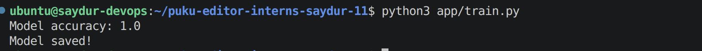
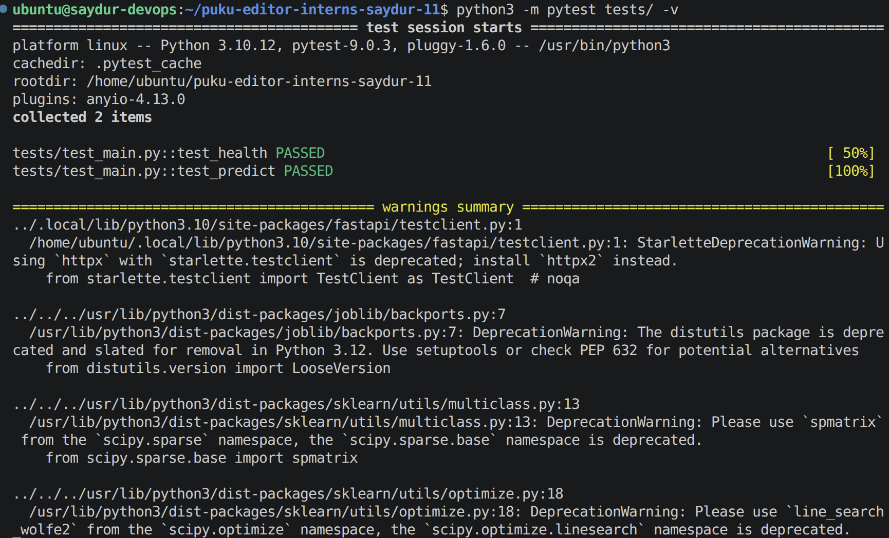
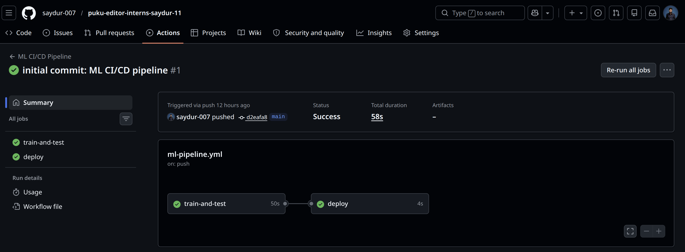
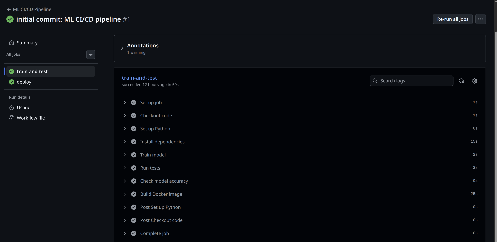
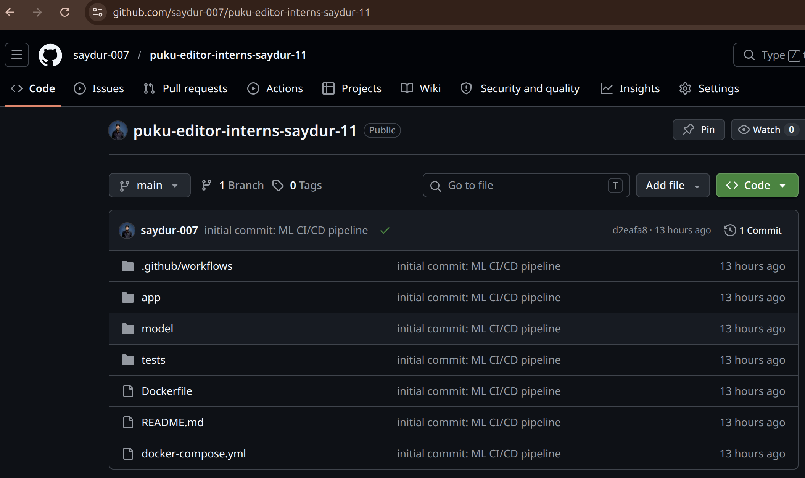

# CI/CD Pipeline for ML Projects

This project demonstrates a simple CI/CD pipeline for a Machine Learning application using GitHub Actions. The pipeline automatically trains the model, runs tests, validates model accuracy, builds a Docker image, and prepares the application for deployment whenever code is pushed to the repository.

---

## Architecture

```text
Code Push
    │
    ▼
GitHub Actions
    │
    ├── Train Model
    ├── Run Tests
    ├── Validate Accuracy
    ├── Build Docker Image
    └── Deploy
```

---

## Technology Stack

| Tool           | Purpose                |
| -------------- | ---------------------- |
| GitHub Actions | CI/CD automation       |
| FastAPI        | API development        |
| Scikit-learn   | Machine Learning model |
| Pytest         | Automated testing      |
| Docker         | Containerization       |

---

## Project Structure

```text
puku-editor-interns-saydur-11/
├── .github/
│   └── workflows/
│       └── ml-pipeline.yml
├── app/
│   ├── main.py
│   ├── train.py
│   └── requirements.txt
├── model/
│   ├── model.pkl
│   └── metrics.json
├── tests/
│   └── test_main.py
├── Dockerfile
├── docker-compose.yml
└── README.md
```

---

## Running the Project Locally

### 1. Clone the Repository

```bash
git clone https://github.com/saydur-007/puku-editor-interns-saydur-11.git
cd puku-editor-interns-saydur-11
```

### 2. Install Dependencies

```bash
pip install -r app/requirements.txt
```

### 3. Train the Model

```bash
python3 app/train.py
```

Training Output:



### 4. Run Tests

```bash
python3 -m pytest tests/ -v
```

Test Results:



---

## CI/CD Pipeline Workflow

Every push to the `main` branch automatically triggers the following steps:

1. Checkout source code
2. Set up Python 3.11
3. Install dependencies
4. Train the model
5. Run automated tests
6. Validate model accuracy (minimum 80%)
7. Build Docker image
8. Deploy the application

GitHub Actions Workflow:



Pipeline Execution:



---

## Model Performance

| Metric   | Value                    |
| -------- | ------------------------ |
| Dataset  | Iris                     |
| Model    | Random Forest Classifier |
| Accuracy | 100%                     |

---

## Automated Tests

The following tests are executed during the pipeline run:

```text
tests/test_main.py::test_health PASSED
tests/test_main.py::test_predict PASSED

2 passed
```

---

## Repository Preview



---

## Author

Saydur Rahman

Puku Editor Internship
Project #11
