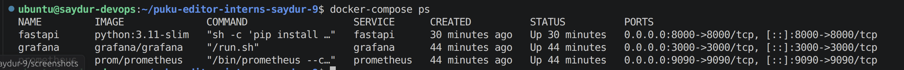
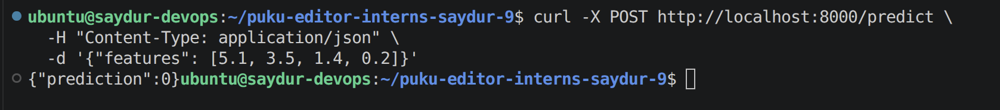
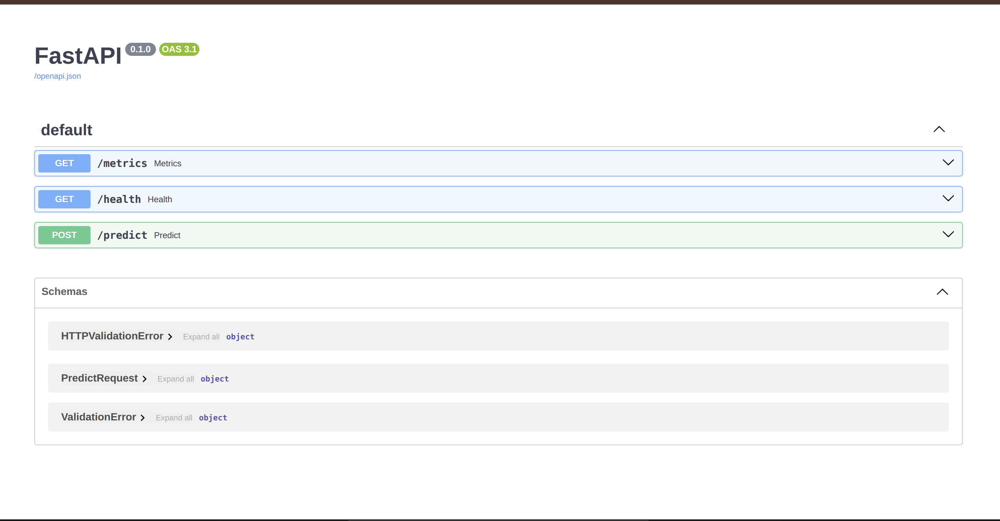
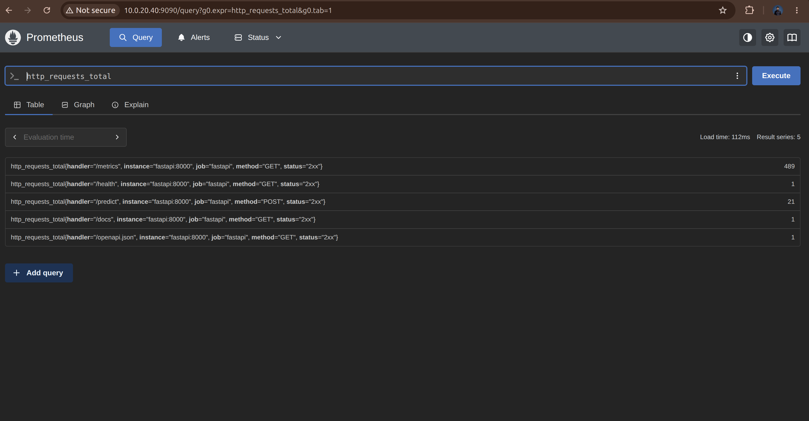
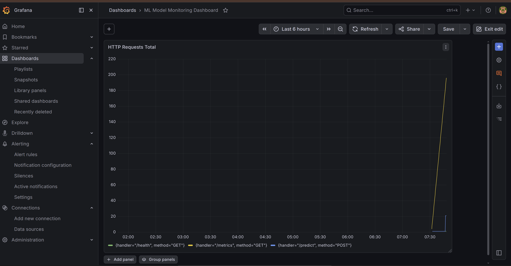

# How to Run the Project

## Requirements

Before starting, make sure you have the following installed on your machine:

* Docker
* Docker Compose

## Step 1: Clone the Repository

Run the following commands:

```bash
git clone https://github.com/PoridhiOSS/puku-editor-interns-saydur-9.git
cd puku-editor-interns-saydur-9
```

## Step 2: Start the Application

Build and start all services:

```bash
docker-compose up --build
```

The first build may take a few minutes depending on your internet speed and system performance.

## Step 3: Check Running Containers

To verify that all containers are running successfully, execute:

```bash
docker-compose ps
```

Example output:



---

# API Endpoints

## Health Check

Use the following command to check whether the API is running properly:

```bash
curl http://localhost:8000/health
```

## Make a Prediction

Send sample data to the model using:

```bash
curl -X POST http://localhost:8000/predict \
  -H "Content-Type: application/json" \
  -d '{"features": [5.1, 3.5, 1.4, 0.2]}'
```

Expected response:

```json
{
  "prediction": 0
}
```

Example:



---

# Available Services

After the containers start successfully, you can access the following services from your browser.

## FastAPI Documentation

Open:

```text
http://localhost:8000/docs
```

This page allows you to test API endpoints directly from the browser.



## Prometheus

Open:

```text
http://localhost:9090
```

Prometheus collects and stores application metrics.



## Grafana

Open:

```text
http://localhost:3000
```

Login credentials:

* Username: admin
* Password: admin

Grafana provides dashboards for visualizing application metrics.



---

# Metrics

The following metrics are monitored:

* Total number of API requests
* Request processing time
* Number of requests sent to the `/predict` endpoint

These metrics are collected by Prometheus and displayed in Grafana dashboards.

---

# Technologies Used

* FastAPI
* Scikit-learn
* Docker
* Docker Compose
* Prometheus
* Grafana

---

# Author

Saydur Rahman

Puku Editor Internship – Project #9
